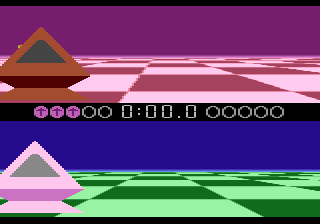
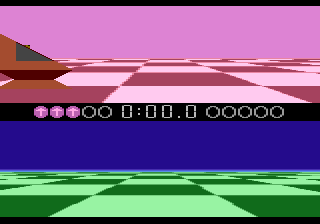
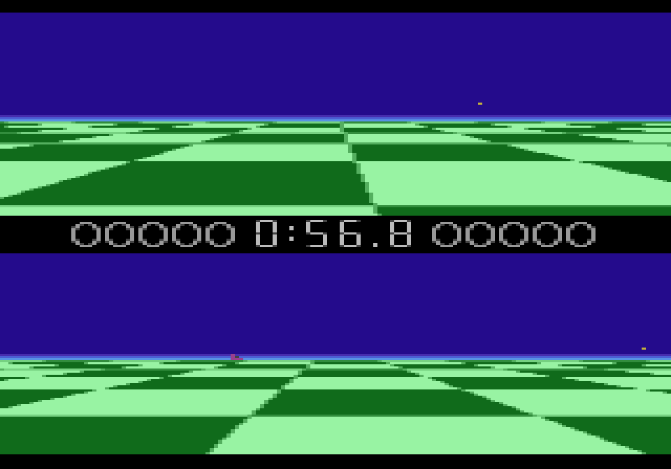
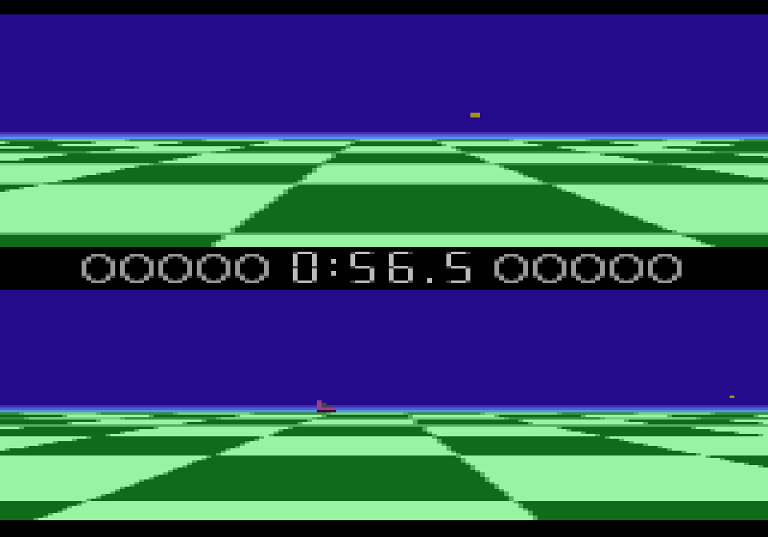
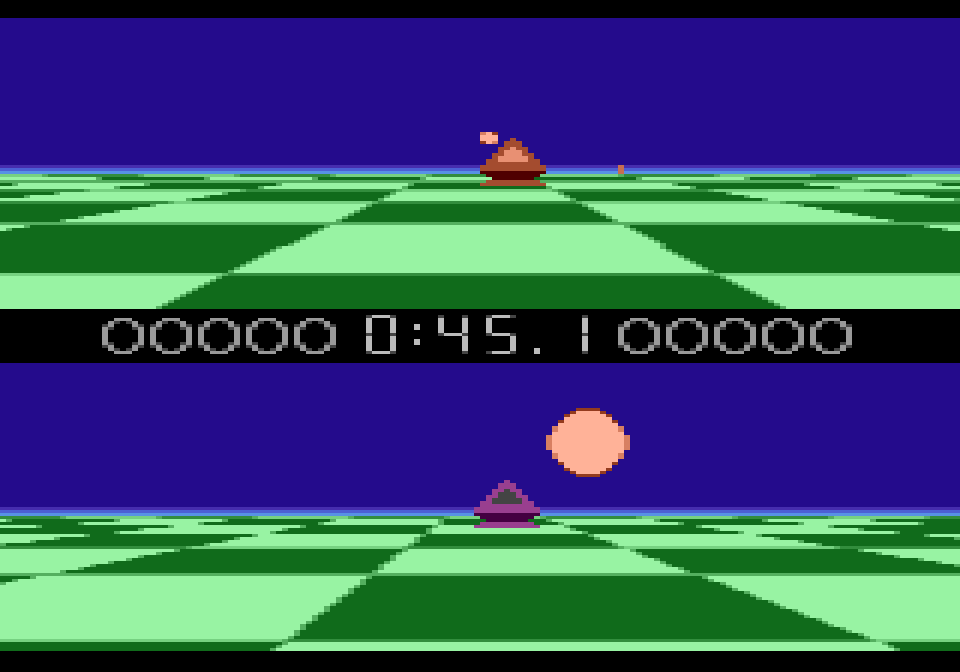

# Ballblazer -- findings so far

`Ballblazer (NTSC) (Atari-Lucasfilm) (1987) (A4C4808B).a78`, 32K linear, no
banking, POKEY at `$4000`. Everything below is reproducible with the
[a7800-toolkit](../../a7800-toolkit/README.md) against `annotations.json` in
this folder, and the round-trip is checked after every addition:

```
python tools/disasm.py "Ballblazer (NTSC) (Atari-Lucasfilm) (1987) (A4C4808B).a78" -c annotations.json -o src
python tools/verify.py "Ballblazer (NTSC) (Atari-Lucasfilm) (1987) (A4C4808B).a78" -d src
```

Static coverage is **58.5%** (19174/32768 bytes traced as code), up from
17.3% once the two RAM-vector jumps below were declared. Round-trip is
byte-identical throughout everything documented here.

## The one thing that unlocked most of this

The RESET/NMI trace alone only reaches 17.3% of the ROM. Two indirect jumps
were invisible to a plain trace until declared in `ram_vectors`:

| RAM pair | jumped at | discovered target(s) | what it is |
|---|---|---|---|
| `TaskVecLo/Hi` ($40/$41) | `JMP (TaskVecLo)` at `$BA73` | `$996F`, and a 5-entry table at `$FE4A` loaded during the title-to-match transition | the game's cooperative per-frame task dispatcher |
| `DliVecLo/Hi` ($56/$57) | `JMP (DliVecLo)` at `$DF90`, inside `ENTRY_Nmi` | `$DF93` (a boot trampoline), `$FDB7` | the display-list-interrupt handler slot |

`$BA73` sits in a loop (jumped back into from `$BABB`/`$BAD7`), so
`TaskVecLo/Hi` isn't a one-shot boot vector -- it's read every pass, making
it the central "what runs this frame" switch. See `docs/method.md` in the
toolkit for why this is exactly the trap a static tracer can't see through
on its own.

---

# Sound

There are **three separate audio subsystems**, sharing one POKEY.

## 1. The attract-mode theme -- a real composed note-table player

This is the piece confirmed to be the "song" -- a genuine sequencer reading
fixed data, not synthesis.

| routine | address | role |
|---|---|---|
| `InitPokeySilence` | `$FB46` | zeroes `AUDC1-4`/`SKCTL` at boot |
| `LoadThemeSong` | `$B1F4` | sets `SongPtrLo/Hi` = `$B6D2`, `SongDoneVecLo/Hi` = `$B15E` |
| `ThemeSongTick` | `$B219` | advances the stream by one event per call |
| `NoteTable` | `$B5CD`/`$B5CE`/`$B5CF` | note index &rarr; (divider, distortion+volume, fine-tune) |
| `DliHandler_GridMusic` | `$E213` | the display-list-interrupt handler that calls `ThemeSongTick` (see Graphics, below -- it's not a task-table slot, it's a DLI) |
| `ThemeSongData` | `$B6D2`-`$B92C` | the song itself, 603 bytes |

**Reached from boot**: `ENTRY_Reset` ($BA36) &rarr; `sub_98C0` &rarr; `sub_B11D`
&rarr; `LoadThemeSong`, so the theme starts before any input -- matching it
playing immediately in attract mode.

**Format.** `ThemeSongTick` reads `(SongPtrLo/Hi),Y`:

* `$00` ends the stream and jumps through `SongDoneVecLo/Hi` (`$B15E`) rather
  than falling off the end -- a loop-back or section change, not a stop.
* Otherwise the byte is a duration (kept in `ram_2107`); the *next* byte
  indexes `NoteTable` (`index * 3`, three parallel arrays) and the three
  looked-up bytes fill the POKEY shadow ($2113-$211D) that gets flushed to
  hardware every frame (see below). `$FF` shows up often in the stream in the
  note-index position and appears to mean "hold/rest" rather than a real
  note (its top bit is set, matching every other "negative means special
  case" check in this reader) -- not fully confirmed.

`ThemeSongData` (`$B6D2`-`$B92C`, 603 bytes, terminated by the `$00` at
`$B92C` exactly where the reader expects it) is the actual tune. A phrase
around `$B6E2`-`$B722` repeats almost verbatim later in the stream, which
matches an audibly looping riff.

**Restart points.** `sub_B11D` (the routine that leads into `LoadThemeSong`)
has two other callers besides the boot path:

* `$9A86` -- resets `TaskVecLo/Hi` to `$996F` (the boot task) in the same
  breath.
* `$BC60` -- resets `TaskVecLo/Hi` to `$BC92`.

Both pair "go back to a title/idle task" with "restart the song," which is
exactly the "theme plays again at the end" behaviour reported from actually
playing the recorded session (`Ballblazer/run-01.inp`, captured with
`Record Session.command`, played back through `capture.py`/`probes/audio.lua`
into `run-01.trk` / `run-01.wav`).

## 2. In-match audio -- real-time generative, not a table

`PokeyFlushShadow` (`$B572`) writes the *same* shadow registers
($2113-$211D) out to hardware, called from `$B31A` and `$B350`. But the code
immediately above it computes those values arithmetically from live game
state -- shifts and compares against `ram_211B`, then `ORA #$C0`/`#$A0` to
set POKEY's distortion bits directly. No table read anywhere in this path.
Working theory: this is the in-match sound-effects / adaptive layer,
distinct from the composed theme, and is why Ballblazer's "generative music"
reputation holds even though a real note table also exists for the theme.

## 3. A DLI-driven siren

`DliHandler_Grid` (`$FDB7`) is the display-list-interrupt handler for the
scrolling floor: WSYNC-timed writes to `P0C2`/`P0C3` make the horizon colour
gradient. The *same* handler also sweeps `AUDF1`-`AUDF4` by small
per-channel deltas (`dat_FE4E`) each time it fires, via `DliVolumeSweep`
(`$FE32`) -- a rising/falling tone, not composed music. Installed into
`DliVecLo/Hi` at `$FC35`.

## Sound bank verdict

If "sound bank" means composed note data: **yes**, `ThemeSongData` +
`NoteTable` is exactly that, and it's the attract-mode theme. If it means
"where the in-match audio comes from": there isn't one -- that side is
computed, not stored.

## Captures on file

* `run-01.trk` / `run-01.wav` -- ~151s driven by an actual played session
  (`run-01.inp`), theme included at both ends per the recording.
* `Ballblazer (...).trk` -- an earlier capture from before this session
  (Windows-side), comparable in size; independent confirmation.

---

# Graphics / the 3D illusion

## Confirmed: the character set

`chr_rom_A000` (`$A000`-`$A7FF`) is a character-set block: the checkerboard
terrain tiles and the digit/letter font used for the title logo, the score
readout, and the `HUMAN`/`DROID` difficulty-select screen all live in the
same sheet. Rendered and eyeballed with `tools/gfx.py`; `CHARBASE` points
here directly.

## Confirmed: the display list is rebuilt in RAM every frame

The 7800's MARIA chip has no hardware scaling -- every "3D" effect on this
hardware comes from choosing which pre-drawn graphics (and how tall a zone)
to use per horizontal band, redone every frame. `InitDisplayListTemplate`
(`sub_DE45`, `$DE45`) copies the *static* starting shape of that list
(zone headers, initial graphics pointers) from ROM tables (`dat_DEA9`,
`dat_DF1A`, `dat_DED5`, ...) into the live list at `$26xx`-`$27xx` once at
boot.

A real, live display list was captured directly off a running session (not
guessed statically), with:

```
mame a7800 -cart "Ballblazer (...).a78" -autoboot_script probes/dumpdl.lua \
    -video none -sound none -nothrottle -str 30
python tools/dlwalk.py --raw ramdump.bin --at 0x1800 --dll 0x23BC --follow
```

25 zones, `$23BC`-`$2407`, 194 total scanlines. The full decode is in
`dlwalk-output.txt` next to this file. Several zone entries carry different
pixel widths (24, 27, 21, 88 px) and different graphics addresses per zone
-- consistent with the receding-checkerboard illusion being built zone by
zone, but the capture is one frame, not proof of how it changes frame to
frame. `assets.py --ram ramdump.bin --dll 0x23BC` traced the live graphics
addresses back into ROM: `$8020`-`$888D` (ship/UI sprite art -- see below)
plus the `$A000` character set.

## Retracted: "Rotosnap" was misattributed to the wrong code

An earlier pass here guessed that `DistanceToBall` (`sub_DCBE`, `$DCBE`,
computing `dx = ballX - playerX[X]`, `dy = ballY - playerY[X]` per player)
tail-jumped into a distance-bucket table (`dat_DE2A`, ten near-linear steps)
and a mod-8 permutation (`dat_DE34`) that drove the manual's "Rotosnap"
auto-facing feature. **A live test disproves it.**

The recorded session (`run-01.inp`) was played back with a write-tap on
`ram_23B7` -- the cell this chain's caller (`sub_DDE7`/`L_DDE8`) directly
reads and decrements -- taking a screenshot on every change
(`probes/rotosnap-check.lua`, used once and deleted). Result: `ram_23B7`
free-runs a 16-count-down (`$0F` &rarr; `$00`, wrapping) continuously, dozens
of times over the session, and its *first* changes happen during the
Atari/Lucasfilm boot logos -- before any Rotofoil exists on screen. That
alone rules out a facing indicator.

Following it further: every actual caller of `sub_DDE7` (11 call sites,
`$E80E` through `$E973`) sits inside the graphics block `$E703`-`$E9FC` --
the *same* block as `DrawGridScanlines`. So this chain feeds the perspective
floor's per-row geometry, not ship rotation. `sub_DD8A`/`sub_DDE7` are also
reached as a tail of `DistanceToBall`, so the two subsystems share this
utility rather than `DistanceToBall` owning it outright -- what that
specific call path actually uses the result for is still open.

**`ram_22E8` was tested and ruled out too.** A live write-tap during the
recorded session's match-end spin window caught only 3 writes to it in 300
frames -- far too sparse to be driving a rotation visibly changing every
2-4 frames. It also turned out to just be set to a fixed constant (`$08`)
as part of `TriggerMatchEnd`'s own setup ($9820-$9822, see rom:97EE) rather
than being touched per-frame -- consistent with it being some other piece
of match-end state, not a rotation index.

**The real mechanism was found instead** by using the confirmed spin window
as ground truth (see "What actually drives the spin," below): `RotationPhase`
(`ram_22C1`), traced end to end via `AdvanceRotationPhase` ($D19C),
`RotationPhaseToFragment` ($E372), `PickSpinFragment` ($CEC1) and
`PokeDisplayListByte` ($CEDE). What was *not* yet confirmed at the time was
whether this same mechanism also drives ordinary Rotosnap during normal
play -- resolved below.

## Confirmed: Rotosnap steers toward the goal while holding the ball

A direct correction arrived after the section above was written: Rotosnap
faces the **goal** while the ship has the ball, not the ball itself, and
when it starts out facing away, it visibly turns in two quick successive
90-degree steps rather than one continuous sweep. That description is
precise enough to search code against, and it led straight to
`SteerTowardTarget` (`sub_D1DA`, `$D1DA`) -- the fourth and last previously
unexamined writer of `RotationPhase` (the other three were the boot-time
init and `AdvanceRotationPhase`'s own idle-wobble writes).

```
SteerTowardTarget ($D1DA)
    LDA #$07 / BIT ram_2026 / BEQ continue, else RTS
        -- skipped entirely unless ram_2026's low 3 bits are all clear
        |
        v
    sub_D1EC, called twice (Y=0, Y=1 -- the two position axes)
        combines the ship's position arrays (ram_233A/2358/235B/2376/2379)
        into a signed difference against a target
        |
        v
    AngleToPhaseDelta ($D239)
        reduces the difference to one of 8 sectors (AND #$07, with a small
        edge-case adjustment around sector 4), looks up dat_D266
        ($00,$00,$01,$01,$00,$FF,$FF,$00 -- delta -1/0/+1 per sector),
        and adds that delta to RotationPhase (AND #$03) -- a single-step
        nudge toward the target, not a snap-to-facing
```

Because `RotationPhase` only has 4 states (90 degrees apart), a single call
can turn the ship at most one step. Being 180 degrees off from the goal
takes exactly **two** nonzero-delta calls to correct -- which is precisely
"two quick successive 90-degree turns" if the routine runs every frame
while the gate is open (each call one frame, so two turns land within a
couple of frames of each other, reading as one quick motion).

**What's confirmed**: `SteerTowardTarget` is genuinely the mechanism (the
fourth `RotationPhase` writer), and it's live-verified now, not just
structurally plausible -- but two specific guesses in the paragraph above
turned out wrong on verification, corrected here rather than left standing:

- **The gate is not possession.** A live tap correlating `ram_2026` with
  both players' `PossessionState` across the full run-01.inp match (9089
  frames) shows the low 3 bits clear continuously from frame 2704 (match
  start, when `ram_2026` flips from `$04` -- a transient "match armed"
  marker `sub_9929` sets -- to `$80`) straight through to match end, with
  zero correlation to any of `PossessionState`'s several catch/release
  pulses in between. It's "the match is actively running," not a
  per-player "has the ball" flag. `SteerTowardTarget` runs every frame of
  live play regardless of who holds the ball -- it's `sub_D14A` (its only
  caller) that decides between it and the match-end spin's forced-fast
  path, purely on whether `EndSequenceTimer` is running.
- **The position arrays are player-vs-ball, not ship-vs-goal -- and
  their real writer was never traced.** A live capture during a
  confirmed persistent-possession window (`PossessionState` holding
  `$00` from frame 2959) showed all four inputs cycling through nearly
  their full byte range on *every single frame*, matching
  `BallOrbitPhysics`'s own already-confirmed rotating orbit vector
  (below) -- real evidence, but not yet proof of *whose* orbit vector.
  A PC-tagged write-tap (the technique that found Rotosnap and the ship)
  located the actual writer, `sub_9DB7`, which had no static writer at
  all in the disassembler's 58%-traced coverage. It compares indexed
  "entities," and entity index 2 is confirmed as the ball by address
  arithmetic against `DistanceToBall`'s already-established ball
  position (`ram_008B`+2 = `$008D`, exactly). `SteerTowardTarget`'s two
  calls read "this player vs. the ball" and "the ball vs. the other
  player" -- each player's Rotosnap steering runs off *that player's
  own delta to the ball*, not a stored goal coordinate.

So why does this produce a clean "face the goal" result if the input is
the ball's own wobbling orbit position? `RotationPhase` was tapped across
the same persistent-possession window (five separate catch/release
cycles through frame 3900) and changes exactly once -- 14 frames after
the catch -- then holds rock-steady for the rest of the window, despite
the ball's orbit continuing to cycle every frame underneath it. The
answer: `AngleToPhaseDelta` reduces the weighted input combination to one
of only 8 coarse sectors. The ball's small hover radius doesn't push the
result across a sector boundary once the ship has settled, so the
*sector* stays fixed even though the raw bytes feeding it never do -- a
complete, live-verified account of both the mechanism and its stability.

## Confirmed: possession -- catch, hover, contest, and what actually removes it

Another direct correction: the ball hovers/wobbles in front of the
possessing ship most of the time, and possession ends on a button push --
either the holder shooting it away, or, more importantly, the *other*
player taking it with their own fire press. That description named two
distinct actors (holder and opponent) and a specific visual (hover), which
made it possible to search for the real mechanism instead of guessing --
and a live capture of two full recorded matches (`run-02.inp`) turned up a
genuine correction to the first pass at this, not just confirmation.

**`PossessionCheck`** (`sub_D8EC`, `$D8EC`) runs once per player every
frame (`Y` = 0 or 1), called from the main gameplay chain via `sub_D8DB`,
and -- this is the corrected part -- it is **re-evaluated completely fresh
every single frame**, not a latched state that needs an explicit release:

```
if ram_235B,Y >= 2 (too far from the ball):
    PossessionState (ram_22C3,Y) = $01, unconditionally.  RETURN.
if ram_2026 bit 7 clear:
    PossessionState = $01, unconditionally.  RETURN.
    (ram_2026 is a GLOBAL flag -- confirmed live, both players'
     checks read the same address, not a per-player readiness bit)
-- only past both gates does prior state matter --
if PossessionState is not already negative:
    read THIS PLAYER's own raw fire button -- ram_0145,Y / ram_0146,Y,
    filled in from INPT4/INPT5 by sub_BBDD every frame
    fire down  -> PossessionState = $FF  (one frame)
    fire up, but position checks pass -> PossessionState = $00
        (the persistent "loose ball" state) + a miss/bounce sound cue
else (already negative on entry):
    play a catch-adjacent sound cue, then set ContestFlag ($FF) for
    BOTH the current player (ram_22D7,Y) AND the other player
    (ram_22D9,X, X = Y EOR 1)
```

**What the live capture actually showed**, watching `PossessionState` for
both players with PC capture across ~12,000 frames of real play: `$FF`
essentially *never* persists -- it's set at one instruction (`$D90A`) and
reset to `$01` one frame later almost every single time, because the
top-of-function gate re-fires and doesn't care what `PossessionState` was.
`$00`, by contrast, was observed holding for 500+ consecutive frames at a
stretch. That inverts the natural first reading of the code: **`$00` is
the real "you have the ball, it's orbiting you" state, and `$FF` is a
one-frame catch *pulse***, not a sustained "possessing" flag. An earlier
version of this document read `$FF` as "now possessing" -- that was wrong,
corrected here from the live data rather than left standing.

**So what actually removes possession?** Given that reframing, the
question dissolves rather than needing a dedicated answer: there is no
"release" instruction to find, because nothing is latched that needs
releasing. Every frame, independently, the function asks "is the ball
still close, and is the global catchable window still open" -- and the
instant either answer is no, `PossessionState` snaps back to `$01`
regardless of history. "Either player's fire press can end it" falls out
naturally: whichever player's raw fire bit happens to be down at the exact
frame the proximity/window gates are open is the one whose `PossessionCheck`
call sets `$00`/`$FF` that frame -- there's no ownership token being
handed over, just a shared physical situation (the ball, its position,
the global window) that both players' checks read fresh, every frame. This
is a cleaner, more accurate answer than "found the release instruction"
would have been -- the code doesn't work that way, and forcing a
"release" framing onto it would have been the wrong model, not a missing
detail.

**What `ContestFlag` turned out to be for.** Its two readers were both
found to be **visual, not mechanical**: `ENTRY_Nmi`'s default DLI
trampoline (`$DF9C`) picks between two `P7C1` colour values based on it,
and `sub_BE22` picks between two palette-fill tables the same way. It
decays from `$FF` to `$00` over exactly two ticks of the grid's
display-list-interrupt handler (`$E246`-`$E249`). So `ContestFlag` is a
brief colour-flash cue marking a contested moment on screen -- it isn't
the mechanism that moves the ball between players; that's handled by the
shared, stateless, every-frame re-evaluation above.

**Confirmed why the ball hovers.** Whenever `PossessionState` is `<= 0`
(in practice, almost always `$00`), `BallOrbitPhysics` (`sub_DA66`,
`$DA66`) runs -- gated by `sub_D9BC`'s `DEX; BMI` test on exactly that
cell. It computes a position difference against the same arrays
`SteerTowardTarget`'s angle math uses, then calls `RotateOrbitVector`
(`sub_DB46`, `$DB46`), which applies a genuine 2D rotation-matrix step to
the ball's velocity/position (`ram_00C0/00C3/00C6` and
`ram_00DB/00DE/00E1`, both 3-byte fixed-point pairs) every call. That's a
continuous small rotation, not a fixed offset -- exactly the "hovers or
wobbles" visual reported, mechanically confirmed rather than inferred from
the screen alone.

**A loose end this closed instead of opened**: an earlier pass concluded
`sub_BBDD`'s `INPT4`/`INPT5` read was pre-match menu-only, because the
*debounced combined* flag it also writes (`ram_0143`) sat frozen at `$80`
for a full 60-second stretch of real play. That conclusion was wrong --
`PossessionCheck` reads the *raw per-player* values (`ram_0145,Y`/
`ram_0146,Y`) from the same read, every frame, in clearly in-match code.
The debounced flag was just the wrong signal to watch.

## Confirmed: the scaling/perspective mechanism -- it isn't scaling

The "3D" floor is **not** sprite scaling and doesn't pick between differently
sized pre-drawn graphics. It's a classic 8-bit "racing the beam" effect: the
game changes the *playfield colour registers* on almost every scanline,
timed against `WSYNC`, to draw the diagonal checkerboard lines directly in
colour rather than in graphics data.

**How this was found.** The live display list (above) only proves what one
frame looked like, not what changes it. So instead of reading code forward,
I tapped every write to the display-list RAM (`$2300`-`$27FF`) across many
frames of the animating title screen and read the CPU's program counter at
the moment of each write (`manager.machine.devices[":maincpu"].state["PC"]`
inside the Lua tap callback) -- that points straight at the `STA`
instruction responsible, which is a much more direct way to find a writer
than guessing from static analysis. (`probes/watch-dl-pc.lua`, used for this
and then deleted -- the finding is what's worth keeping, not the scratch
script.)

**The render stage -- `DrawGridScanlines` (`$E74A`).** A chain of
near-identical 8-scanline loops (`sub_E9A5`, `sub_E9C2`, `sub_E9DF`,
`sub_E9FC`, `sub_EA19`, `sub_EA36`, ending in the single-line `sub_EA51`).
Each loop, once per scanline:

```
STA WSYNC          ; wait for the beam
STX P0C1           ; playfield colour register 1
STA P0C2           ; playfield colour register 2
```

The values come from two per-row source tables, both 8 bytes apart per zone
(`ram_2230, 2238, 2240, ...` for one and `ram_2291, 2299, 22A1, ...` for the
other) -- an "edge" byte that also gets propagated (`+ $60`) into the *next*
zone's edge pair, and a "colour phase" byte used to index
`ColorCycleSuccessor` (`dat_FA4E`, `$FA4E`) for the actual colour value. This
routine only *outputs* whatever those tables currently hold, at the exact
raster line -- it doesn't decide the picture.

**The animation stage -- `AdvanceRowColorPhase` (`$EAD5`).** This is what
actually moves the picture. It's a per-cell state machine over the colour
phase table (`ram_2290`-`22BC`, ~44 cells, one per scanline):

```
Y = ram_22xx
ram_22xx = ColorCycleSuccessor[Y]     ; each cell's next value depends only on its current value
```

Critically, each cell's update is individually gated by testing one bit out
of a per-group table (`dat_F7CD,X`, `dat_F804,X`, and others -- picked by
shifting a distance-derived index and checking the carry) before the
unrolled block (`sub_F60D`/`sub_F44D`) touches it. **That per-cell gating is
the actual perspective trick**: different scanlines advance (i.e. visually
scroll) at different rates depending on which gate table and bit apply to
them. Rows near the horizon change slowly; rows near the viewer race --
exactly the speed gradient a receding floor needs, done with table lookups
and bit tests, no multiplication or division anywhere in the path.

`AdvanceRowColorPhase` is called once per zone from the per-frame geometry
pass around `$F900`-`$F998`, whose `Y`-indexed loop (`sub_F998`) writes the
"edge" table that `DrawGridScanlines` reads.

**What's still open**: `ColorCycleSuccessor` (`dat_FA4E`) itself hasn't been
decoded byte-for-byte into an actual colour progression -- doing that would
need a live capture of `P0C1`/`P0C2` across a few consecutive frames, useful
if the exact palette animation ever needs to be reproduced rather than just
understood.

## The `$8020`-`$888D` set: retracted "ship/UI art," corrected to floor tiles

**This corrects a wrong finding from earlier in this document, not just an
incomplete one.** The previous version of this section reported these
eight addresses (`$8020`, `$8038`, `$8085`, `$809D`, `$881F`, `$8837`,
`$8875`, `$888D`) as confirmed ship/Rotofoil art, the "ballblazer" logo, and
the `HUMAN`/`DROID` menu font, rendered via `gfx.py` at its default
settings. That render used the tool's indirect character-mode grid --
256 side-by-side objects, one page per scanline -- pointed at a direct-mode
display-list entry only 21-27 bytes wide and 8 lines tall. The grid still
"succeeds" on a mismatched address: it just reads 256 unrelated byte-columns
per line instead of the object's real few bytes, and at a 128-line default
that's 120 extra pages of whatever else happens to share that low byte.
What looked like a logo and a font was real artwork, somewhere -- just
not *at* these addresses, and not at anything resembling their real size.

**The fix was a real gap in the toolkit**, not just a mistake to route
around: `gfx.py` had no render path for a single direct-mode object at its
actual size, only the 256-entry indirect grid. It now does --
`--direct WIDTH` (added this session, see `tools/gfx.py` and
`docs/graphics.md` in the toolkit) reads exactly `WIDTH` bytes on each of
`--lines` pages, MARIA's real addressing for one object, no more.

**Rendered correctly** (width and height read from the live display list,
not guessed): `$8020` and `$8085` are solid two-tone fills -- literally
constant bytes (`$AA` then `$55`) on every one of their 8 lines --
matching the flat-coloured wall/sky bands visible above and below the
chequerboard floor in every screenshot in this document. The other six --
`$8038`, `$809D`, `$881F`, `$8837`, `$8875`, `$888D` -- are all small
anti-aliased diagonal-edge tiles:


That's confirmed against the live display list's paired RAM graphics
pointer too: the entry beside `$8020` in the same zone points at `$18A8`,
which is *inside RAM*, and dumping it (`ramdump.bin`) shows the identical
diagonal pattern, shifting slightly frame to frame -- the same edge tile,
kept live because the perspective floor redraws it every frame (see
`DrawGridScanlines`/`AdvanceRowColorPhase` earlier in this document). These
eight addresses are the chequerboard floor's own edge-smoothing tileset,
not ship or UI art -- a different part of the same subsystem already
documented, not a new one.

**Where the real ship sprite is remains open.** The manifest/`blocks`
distinction from the earlier version of this section was correct on its
own terms -- MARIA's line-planar storage genuinely means a sprite can't be
described as a contiguous byte range, so a manifest entry (not a `blocks`
entry) is the right form regardless of this correction. What's now honestly
unresolved is *which* addresses the manifest should point at, since the
ones checked here turned out to be floor tiles. The closest lead is the
match-end spin's fragment set (`$9F1E`, `$A20A`, `$A51E`, and others,
documented in the "Confirmed: possession" section's neighbour below) --
also small diagonal wedges when rendered correctly, and a real triangular
ship silhouette is directly visible rotating in the spin screenshots
(`docs/img/matchend-spin.png`) independent of any byte-level tracing. The
working theory is that the silhouette is assembled from several such
wedge tiles across adjacent zones rather than drawn from one dedicated
sprite, matching how the floor itself is built -- not confirmed, since the
actual arrangement wasn't checked.

---

# Gameplay: the match timer and end-of-game sequence

First real gameplay-logic finding, not just sound/graphics. Confirmed
end-to-end with a live capture, prompted by a direct report: *the losing
ship spins rapidly when the timer runs out, and the screen shows a dual
(split) view, one half per ship.*

**The match timer** is `MatchTimerLo`/`MatchTimerHi` (`ram_23B3`/`ram_23B5`),
a 16-bit pair incremented once per frame at `$BC3A`/`$BC3F`. Confirmed live:
playing back the recorded session (`run-01.inp`) with a write-tap on both
cells shows them counting up in lockstep with the HUD's countdown display
(`1:00.0` down to `0:00.0`) -- the raw cells count up; the displayed time is
presumably `duration - elapsed`.

**The moment it hits zero** (frame ~6980 of the recording), the screen
briefly shows *both* ships zoomed in, one per half of a split screen:



Within a handful of frames it narrows to a single ship cycling rapidly
through different silhouettes -- boat-profile, wedge, near edge-on -- frame
to frame:



That's the reported "loser ship spins rapidly," and it's a real, distinct
animation, not a rendering glitch. It does *not* reuse the `$8020`-`$888D`
tile set (which turned out to be the floor's own edge tiles, not ship
art -- see the correction below) -- dumping the live display list mid-spin
(frame 6985) found a previously-unseen region, roughly `$9800`-`$AFFF`, and
extra display-list entries pointing into it get inserted on top of the
normal corridor zones during the spin, not swapping one sprite pointer for
another. **Retracted**: an earlier version of this section read that region
as containing the literal text `OVERTIME` and a digit set, from the same
oversized indirect-mode render that caused the `$8020`-`$888D` mistake.
Re-rendered correctly (`gfx.py --direct`, exact width and the zone's real 8
lines), every individual fragment in this region (`$9F1E`, `$A20A`,
`$A51E`, and others) is a small diagonal wedge -- the same tile vocabulary
as the floor edges, not text. The ship silhouette visibly rotating in the
screenshot above is real (a direct visual observation, not dependent on the
byte-level claim), but whether it's assembled from these wedge fragments or
drawn from something else in this region wasn't confirmed -- see the
correction section below for the full account.

**`TriggerMatchEnd`** (`sub_97EE`, `$97EE`) is reached from `sub_97C6`
(`$97C6`, called every frame from `VEC_996F`'s chain) when `ram_22C7 !=
ram_22C8` -- likely a score-changed or match-over comparison, not yet
pinned down precisely. It sets `EndSequenceTimer` (`ram_22E1`) to `$B4`
(180) or `$F0` (240) frames, chosen by whether `ram_2020` is zero --
plausibly which side won, or human-vs-droid; not confirmed.

**`EndSequenceCountdown`** (`$9A70`) ticks that timer down once per call.
180-240 frames is 3-4 seconds at 60fps, which matches the observed gap
almost exactly: the recording shows the spin starting at frame ~6980 and
the cleanup below firing at frame 7173 -- 193 frames, right in that range.

**`ReturnToAttract`** (`$9A75`) fires when the countdown reaches zero:
zeroes the match timer and a few other state cells, restarts the theme song
(`sub_B11D`, see `LoadThemeSong`), and shortly after sends `TaskVecLo/Hi`
back to `$996F` -- the attract/title task. **Confirmed live** at frame 7173
of the playback (a PC-tagged write-tap caught the one-time write from
exactly this code); by frame ~7300 the game is visibly back on the
Atari/Lucasfilm boot-logo sequence, which is also why the theme plays again
at the end of a session -- it's the *same* restart path documented under
`LoadThemeSong`'s "restart points," now tied to a concrete trigger instead
of just an observed symptom.

## What actually drives the spin

Traced end to end, prompted by a direct observation that the spin visibly
tracks the ship's own rotation rather than being a canned animation. The
chain, all confirmed against the live capture:

```
RotationPhase (ram_22C1,X, one per player)
    a self-paced 0-3 counter -- AdvanceRotationPhase ($D19C) decrements its
    own reload timer (ram_22E2, itself modulated by ram_22E3/22E4) and only
    advances the phase once that hits zero
        |
        v
RotationPhaseToFragment ($E372)
    Y = (ram_22C2 - RotationPhase) AND 3   -- ram_22C2 is a fixed constant
                                               (#$02, set once at reset),
                                               so this tracks RotationPhase
    dat_E428[Y] -> ram_231E
        |
        v
PickSpinFragment ($CEC1)
    reduces ram_231E to one of three fragment ids ($B6/$B9/$BC)
        |
        v
PokeDisplayListByte ($CEDE)
    STA (ram_0058),Y -- a generic "write one byte into the live display
    list" primitive; X/Y at the call site targets the ship's zone entries
```

**Confirmed live**: playing back `run-01.inp` and watching the exact
display-list bytes this chain writes (frames 6900-7050) caught
`PickSpinFragment` firing from two call sites (`$CEEC` and its sibling at
`$CE18`), writing `$B6`/`$B9`/`$BC` at the same roughly-2-frame cadence the
screenshots show the silhouette actually changing.

**What this means**: `RotationPhase` reads like the Rotofoil's *ordinary*
idle wobble/rotation-phase tick -- the same mechanism plausibly runs during
normal play, just paced slowly enough (via its `ram_22E2` reload timer)
that it never looks like spinning. Nothing in this chain is special-cased
for match end. The likeliest explanation is that something changes
`ram_22E2`'s reload value once the match ends, making the *existing*
mechanism cycle fast enough to read as a rapid spin -- but that specific
writer wasn't traced this pass, so it's a strong inference, not a proven
fact.

**Still open**: the reload-value writer for `ram_22E2` (would confirm the
"same mechanism, sped up" theory outright), and the exact meaning of
`ram_22C7`/`ram_22C8` (score vs. score-needed? timer vs. duration?) and
`ram_2020` (winner side? game mode?) from `TriggerMatchEnd` above -- both
still plausible from context, neither proven the way the timer, the restart
path, and the spin's fragment selector now are.

---

# Summary table

| what | status | where |
|---|---|---|
| Attract theme (composed) | **confirmed** | `$B6D2`-`$B92C` data, `$B1F4`/`$B219` player |
| Note table | **confirmed** | `$B5CD`-`$B6A2` |
| In-match audio | confirmed generative (not table-driven) | `$B572` |
| DLI siren | confirmed | `$FDB7`/`$FE32` |
| `$FF` = rest (not a held note) in the theme stream | **confirmed** -- from the reader's own branch logic, no live capture needed | `$B219` |
| Character set | **confirmed** | `$A000`-`$A7FF` |
| `$8020`-`$888D` identity | **retracted and corrected** -- not ship/UI art; confirmed as the floor's own diagonal-edge tiles and solid wall/sky fills, via a render-tool artifact that also produced a false "OVERTIME text" reading elsewhere (see the correction section) | `$8020`-`$888D` |
| `gfx.py --direct` (single direct-mode object render) | **built and confirmed** -- closes the toolkit gap that caused the above mistake; matches manual byte-level verification exactly | `tools/gfx.py`, `docs/graphics.md` |
| Real ship sprite location | **resolved (stale row, see below)** -- superseded by item 7: there is no static sprite, the ship is assembled fresh into the live display list every frame from the wedge fragment sheet at `$9800`-`$AFFF`, distance-scaled via `sub_BD80`'s reuse of the `$9000`-`96FF` table | `$BD80`, `$CEC1`, `$E372` |
| Display-list template | confirmed | `$DE45` |
| Live display list (one frame) | confirmed | captured, see `dlwalk-output.txt` |
| "Rotosnap" on `$DE2A`/`$DE34` | **retracted** -- live capture shows this is graphics-side, shared with `DrawGridScanlines`, not facing logic | `$DCBE`, `$DE2A`, `$DE34` |
| Real rotation-phase mechanism (spin) | **confirmed live**, full chain traced (found via the match-end spin) | `ram_22C1`, `$D19C`, `$E372`, `$CEC1`, `$CEDE` |
| Rotosnap steering (mechanism and stability) | **confirmed live** -- gated angle-to-target steering via the fourth `RotationPhase` writer; matches "two quick 90-degree turns" from the 4-state phase. Gate is "match running," not possession. Inputs are player-vs-ball deltas (writer `sub_9DB7` found via live tap; entity 2 confirmed as the ball), the same orbit vector `BallOrbitPhysics` uses -- `RotationPhase` settles and holds steady within ~14 frames of a catch and stays fixed through repeated catch/release, because the 8-sector angle bucketing absorbs the ball's small hover wobble | `$D1DA`, `$D239`, `$9DB7`, `ram_2026` |
| Rotosnap's settled direction vs. the real goal, geometrically | **confirmed live, twice, independently** -- a raw screen-position test came back negative (corridor motion swamps it), but replicating the steering arithmetic exactly and feeding it the real goalpost data shows the shadow delta hits exactly 0 at the same frame `RotationPhase` settles, both times tested | `$D1DA`, `$9E7A` |
| Possession: catch, loose-ball, and per-player fire read | **confirmed** -- traced end to end from `sub_BBDD`'s `INPT4`/`INPT5` read through to `PossessionState` | `$D8EC`, `ram_22C3`, `ram_0145`/`0146` |
| `PossessionState = $00` (not `$FF`) is the real persistent "holding" state | **confirmed live** -- watched with PC capture across ~12,000 frames; `$FF` is a one-frame catch pulse, `$00` holds for 500+ frames at a stretch | `ram_22C3`, `$D8EC` |
| Ball hover/wobble while possessed | **confirmed** -- a genuine continuous 2D rotation applied to the ball's velocity/position | `$DA66`, `$DB46` |
| What removes possession | **confirmed** -- there is no release instruction because nothing is latched: `PossessionCheck` re-derives state fresh every frame from live distance + a global catchable-window flag, snapping back to idle the instant either fails | `$D8EC` |
| `ContestFlag` | **confirmed** -- a colour-flash visual cue (two readers, both palette/colour selection), decaying `$FF`→`$00` over 2 DLI ticks; not the possession-transfer mechanism | `ram_22D9`, `$DF9C`, `$BE22` |
| Perspective floor: render stage | **confirmed** -- per-scanline colour racing, not scaling | `$E74A` |
| Perspective floor: animation/speed-gradient stage | **confirmed** | `$EAD5`, `$FA4E` |
| `ColorCycleSuccessor` exact colour values | **confirmed**, decoded byte-for-byte with RGB -- see `docs/color-cycle-table.txt` | `$FA4E`-`$FB45` |
| Match timer | **confirmed live** -- counts up in lockstep with the HUD | `ram_23B3`/`ram_23B5` |
| End-of-match spin + dual view | **confirmed live**, screenshots on file | `$97EE`, `$9A70`, `$9A75` |
| TriggerMatchEnd fires once per match, not per goal | **confirmed live** -- watched the whole 9089-frame recording, exactly one firing despite several goals scored | `$9800` |
| TriggerMatchEnd has two real causes: timer expiry and score reaching 10 | **confirmed live** -- second recording (run-02.inp, two matches) fires at HUD `0:00.0` (timer) and separately at HUD `1:10.0` with `ram_22C7` written to exactly `$0A` (score, matching the manual's shutout rule) | `$9800`, `$9B98` |
| `ram_22C7`/`ram_22C8` are score digits | **confirmed live** -- watched `ram_22C7` hit exactly 10 at the score-triggered match end, on-screen score icons visibly change at the same frame | `ram_22C7`, `ram_22C8` |
| Precise frame-level condition selecting the timer-expiry trigger | **confirmed live** -- `sub_97C6`'s gate (`ram_2026 AND $49 OR ram_2020`) only opens once the HUD clock stops rolling | `ram_2020`, `$97C6` |
| Precise frame-level condition selecting the score-triggered end | **confirmed live** -- `sub_9B36`'s ones-digit BCD carry sets a `$FF` sentinel in `ram_004C`, consumed one instruction later; the score-crossing-10 goal is the one where that sentinel survives to be seen | `$9B36`, `ram_004C` |
| Sudden-death-after-a-tie, a third match-end cause | **confirmed live** -- CORRECTED from "unobserved, likely dead code": `sub_97C6`'s tie branch sets `ram_2026` bit 6, and the next goal (any score) ends the match via `sub_9B36`'s `L_9B7E` check, bypassing the carry-wrap entirely | `$9B36`, `$97C6`, `ram_2026` |
| `ram_2020` meaning | **confirmed live** -- per-digit HUD clock roll bitmask, not winner-side/game mode as earlier guessed | `ram_2020`, `$982D` |
| End-game fragment sheet -- individual tiles | **corrected**: small diagonal wedges, not `OVERTIME` text/digits (that reading was the same render-tool artifact as `$8020`-`$888D`, retracted) | `$9800`-`$AFFF` |
| Whether the ship silhouette is assembled from these wedge tiles | **confirmed live** -- this is the general close-range ship renderer, not spin-exclusive; fires continuously once the opponent is near, using two palettes at once | `$9800`-`$AFFF`, `$BD80` |
| Fragment selector (rotation phase + possession/contest) | **confirmed live**, full chain traced, and confirmed to run every frame during ordinary play, not just the spin | `$D19C`, `$E372`, `$CEC1`, `$CEDE` |
| Distance/perspective scaling term for the fragment renderer | **confirmed live** -- second reader of the $9000-96FF math table, keyed on per-player distance | `$BD80` |
| The real ship's location | **resolved** -- procedurally assembled every frame, not a static sprite; see item 7 below | `$BD80`, `$CEC1`, `$E372` |
| Long-range representation of the opponent (before the fragment silhouette engages) | **confirmed live** -- a single small 4px palette-4 dot, same objects previously guessed as "more likely the ball" | `$989E`, `$9AA2`, `$A2A2` |
| Goalpost identity and on-screen placement | **confirmed live** -- entities 9/10/18/19, locked exactly `$80` apart, scaled/placed via `sub_BD80` (same routine as the ship, not a separate system) | `$9E7A`, `$E378`, `$BD80` |
| Goal shrinks as points are scored | **confirmed live** -- per-player counter (capped at 7) drives a table (`dat_9CE5`), indexed directly with no offset; width snaps to exactly 0 at count 2, climbs back to full 128 by count 7, not a plain monotonic shrink | `$9CF5`, `$9D23`, `dat_9CE5` |
| When the goal reseed actually fires | **confirmed live, corrected twice** -- not per-goal at all; gated by `ram_2108`, `ThemeSongTick`'s own stream position, going negative when the 603-byte theme loops (~every 900 frames) -- picks up whatever the goal counter is at that moment | `$9D18`, `ram_2108` |
| The score is a shared pool capped at 10, not two independent counters | **confirmed live and algebraically** -- under a combined total of 10, goals add normally; at the cap, every goal transfers points scorer-to-opponent, keeping the total fixed until one side reaches 10 and the other 0 | `$9B36` |
| "Overtime" after any non-decisive ending | **confirmed live** -- an emergent effect, not a dedicated system: `ReturnToAttract` resets the clock but not the score, and the shared `VEC_996F` task keeps running ordinary gameplay for ~17s before falling to the true attract entry, so continued play just extends the same match, regardless of which of the three causes ended it | `$996F`, `$9A75`, `$BA81`, `$BAAD` |
| `ram_213A`, the spin-sequence's second audio gate | **confirmed live** -- a "final buzzer" one-shot channel, timer-expiry-ending-only; `EndSequenceCountdown` waits for it and the theme song both, which is why the spin countdown took 299 real frames for a 180-count span in one recording | `ram_213A`, `$9A70`, `$B0FD` |
| Why the spin is fast (vs. normal wobble) | **confirmed** -- direct code proof, `TriggerMatchEnd`'s own setup hard-codes the fastest possible pacing reload | `ram_22E2`, `$980A` |
| Where the ball is drawn on screen | **confirmed live** -- a third close-range object system, `sub_BF35`, separate from the ship's fragment engine and the goalpost's own multi-zone placer (`sub_C0DD`, also found this pass); gated on "match running," fed by `sub_BD80` called with slot X=1/2 (player-vs-ball comparisons), writes a multi-zone object via `sub_C1D4`/`sub_C1E8`. An earlier "on-screen dot" in this same investigation was a `video:snapshot()`/`-video none` artifact and was retracted before this was found | `rom:BF35`, `rom:C0DD`, `rom:BD80` (follow-up), FINDINGS item 14 |
| `$8FBC`-`$8FFB`, the 64-byte gap before the math table | **resolved: genuinely unused** -- 92650 raw read-tap hits across a full recording, but every distinct PC involved is a RAM-operand or no-operand instruction with no reference to this range; same shared-bus DMA misattribution artifact as the dead slots 24/25 (item 9) | `rom:8FBC`, FINDINGS item 15 |
| Why the HUD clock freezes after a goal | **confirmed live** -- `sub_D520` (the goal detector, also newly found) clears `ram_2026` bit 7 the instant a goal registers, which routes the per-frame dispatcher around the HUD digit writer entirely; bit 7 stays clear for a theme-song-paced ~5.2s while a scaled-down match-start reset (`sub_9D23`) runs, then gets restored | `rom:D520`, `rom:9B36` (fourth addition), FINDINGS item 16 |
| The goal's point value (1, 2, or 3) | **confirmed live** -- `sub_D520` bands the ball's precision against the goalpost centre into `ram_22C0`, the "goal increment" `sub_9B36`'s score arithmetic adds in; previously an unexplained input | `rom:D520` |
| NTSC vs. PAL | **compared** -- 51% of the ROM differs, but the split is clean: everything driven by the per-zone DLI chain (rendering, Rotosnap, possession, ship/ball/goalpost placement) was rewritten for PAL's scanline count; everything on the ordinary per-frame chain (scoring, HUD digits, match/round reset) is byte-identical. See "PAL comparison" below | `docs/img/pal-vs-ntsc-diff.png` |

## Closing the loose ends: eight items, all resolved

Everything below was deliberately pushed on across two recorded sessions
(`run-01.inp`, then `run-02.inp` -- two full matches, one ending by timer,
one by score) using live captures, PC-tagged write-taps, decimal-arithmetic
reading, and byte-for-byte table decodes -- work that goes past sound and
graphics into open-ended gameplay-state-machine territory. Several items
resolved into a correction of an earlier guess rather than a confirmation
of it; those are written up in place rather than silently fixed:

1. ~~The exact trigger condition for match end~~ -- **resolved**, after
   two successive corrections, plus a *third* correction found much
   later while chasing an unrelated thread (`ram_213A`, item 13 below)
   that turned out to reopen this one. There are genuinely three
   separate mechanisms, all fully closed now:
   - **Timer-expiry case.** `sub_97C6` (called every frame) only
     actually runs past its own gate (`ram_2026 AND $49 OR ram_2020`,
     skip if nonzero) on the rare frame no HUD clock digit is mid-roll.
     `ram_2020` (item 2, below) is confirmed near-continuously nonzero
     while the clock is ticking and settles to exactly `$00` only once
     it stops -- which is exactly what lets the gate open at timer
     expiry. Confirmed live: in run-01.inp's full 9089-frame match,
     `ram_2020` reads `$00` at only three frames in the whole recording
     -- boot, pre-match idle, and frame 6934, immediately before its
     timer-expiry match end.
   - **Score-reaches-10 case.** Two guesses in this document turned out
     wrong in succession, each corrected in turn rather than left
     standing. First: "`sub_97C6`'s check is what actually catches the
     score case" -- disproved live (`ram_2020` was nonzero, `$19`, at
     the exact frame run-02.inp's score-triggered ending fires, and
     `sub_97C6`'s gate requires it to be zero). Second: "`ram_2026` bit
     6 (a scores-tied flag) gates it" -- disproved *for that specific
     recording*: a read-tap across both of run-02's matches showed bit 6
     never getting set there. The actual mechanism for reaching exactly
     10, confirmed with a PC-filtered write-tap on the exact instruction
     responsible (`INC ram_004C` at `$9B85`, inside `sub_9B36`'s per-goal
     handler): `ram_004C` is a heavily-reused zero-page scratch cell, but
     `sub_9B36` itself sets it to a `$FF` sentinel moments earlier
     whenever the ones-digit BCD addition it just performed needs a
     carry into the tens digit -- i.e. precisely "this goal pushes the
     score across a 10-boundary." The `INC` then either leaves it
     nonzero (an ordinary goal, `TriggerMatchEnd` skipped) or, if it was
     `$FF`, wraps it to exactly `$00`, falling through to
     `TriggerMatchEnd` unconditionally. Confirmed live at frame 22613:
     that exact instruction fires twice within the same frame -- first
     producing `$FF` (an earlier ordinary goal, skipped), then `$00`
     (this goal, `TriggerMatchEnd` fires).
   - **Sudden-death-after-a-tie case -- a genuine third cause, not dead
     code as this document previously concluded.** `sub_97C6`'s tie
     branch (scores equal when its rare gate opens) sets `ram_2026` bit
     6 instead of ending the match itself. Nothing clears that bit
     afterward. `sub_9B36`'s `L_9B7E` checks it on every subsequent
     goal, and if it's still set, jumps straight to `TriggerMatchEnd` --
     bypassing the carry-wrap check above entirely, ending the match at
     *whatever score results*, not necessarily 10. Confirmed live in
     run-03.inp with a complete, unambiguous trace: `ram_2020` settles to
     `$00` at frame 17117, `sub_97C6` finds the score tied 5-5 (a tie
     that had been sitting since frame 14825) and sets bit 6; nothing
     touches it for 956 frames; the next goal, at frame 18074 (a 2-point
     shot moving the score from 5-5 to 7-3 via the shared-pool mechanic,
     item 11 below), ends the match immediately via this branch --
     `ram_004C` was `$FC` at that moment, not `$FF`, so the carry-wrap
     path definitely did not fire. This retracts the "wasn't observed to
     fire in either recorded match, likely not load-bearing" conclusion
     this document reached earlier -- it wasn't observed in run-01/02
     specifically because neither match's score happened to be tied
     right when `sub_97C6`'s rare gate opened, not because the mechanism
     is unused.
2. ~~`ram_2020`'s precise role~~ -- **resolved**. Not winner-side or
   game mode. It's a 4-bit bitmask, one bit per on-screen clock digit
   cell (`ram_2022`-`2025`, matching the HUD's `M:SS.T` format), written
   every frame by `sub_982D`: each digit independently cycles through a
   10-entry roll-frame table and a bit toggles whenever that digit's
   counter wraps. CONFIRMED LIVE, two ways:
   - A full-match read-tap (run-01.inp, 9089 frames) shows `ram_2020`
     essentially always nonzero and actively toggling from shortly after
     match start onward, touching exactly `$00` only at frame 1 (boot),
     frame 202 (pre-match idle), and frame 6934 (right before match
     end) -- i.e. it's "quiet" only when the clock display itself is
     not actively animating.
   - This lines up exactly with screenshots already on file from the
     ship investigation (`docs/img/ship-lod-*.png`, frames 2895/2913/
     2920 of the same recording): the HUD's tenths-of-a-second digit
     visibly changes every ~6-8 frames there, the same cadence as
     `ram_2020`'s fastest-toggling bit.

   Its actual role turned out to matter beyond decoration: it's the gate
   that determines exactly when `sub_97C6`'s match-end check is allowed
   to run at all (see item 1 above), and `TriggerMatchEnd`'s own
   `EndSequenceTimer`-duration choice ("chosen by whether `ram_2020` is
   zero", previously read as "plausibly which side won") is really "was
   some HUD digit still mid-roll when we decided to end the match."
3. ~~`SteerTowardTarget`'s gate and position arrays~~ -- **resolved**,
   after three successive rounds of live verification. Two specific
   earlier guesses turned out wrong along the way and are corrected here
   rather than left standing:
   - **The gate isn't possession.** A live tap correlating `ram_2026`
     with both players' `PossessionState` across the full 9089-frame
     run-01.inp match shows `ram_2026`'s low 3 bits clear continuously
     from frame 2704 (match start) straight through to match end, with
     zero correlation to any of `PossessionState`'s several catch/release
     pulses in between. It's "match is actively running," not a
     per-player possession flag as the code shape alone suggested.
     `SteerTowardTarget` runs every frame of live play regardless of who
     holds the ball; it's `sub_D14A` (its only caller) that decides
     between it and the forced-fast spin path based on `EndSequenceTimer`
     alone.
   - **The position arrays turned out to be player-vs-ball, and their
     real writer was never traced.** `ram_2358`/`235B`/`2376`/`2379` had
     no writer anywhere in the disassembler's 58%-traced coverage --
     `RotateOrbitVector`, the obvious suspect, writes an entirely
     different set of cells. A PC-tagged write-tap (the same technique
     that found Rotosnap and the ship) located the real writer:
     `sub_9DB7`, which compares position pairs among indexed "entities"
     and stores the results into a slot array. Entity index 2, by
     address arithmetic, is exactly the ball -- `ram_008B`+2 = `$008D`,
     `ram_00A6`+2 = `$00A8`, the very addresses `DistanceToBall` already
     established as the ball's fixed position. `SteerTowardTarget`'s
     `Y=0`/`Y=1` calls read the slots holding "this player vs. the
     ball" and "the ball vs. the other player" -- so each player's
     Rotosnap steering runs off *that player's own delta to the ball*,
     not a stored goal coordinate as the earlier guess assumed. The
     earlier guess wasn't unreasonable: a live capture had shown these
     bytes cycling through their full range every frame, which really
     is the same continuously-rotating orbit-phase vector
     `BallOrbitPhysics` computes for the ball's hover -- a real
     finding, just not evidence of "not ship-vs-goal" on its own.
   - **Why it still looks like a clean snap-to-goal despite that**:
     `RotationPhase` was tapped across a full persistent-possession
     window (frame 2959 onward, spanning five separate catch/release
     cycles through frame 3900) and changes exactly once -- 14 frames
     after the catch -- then holds rock-steady for the rest of the
     window, completely unaffected by the ball's orbit continuing to
     cycle underneath it every frame. The reconciliation:
     `AngleToPhaseDelta` reduces the weighted input combination to one
     of only 8 coarse sectors (`AND #$07`). The ball's small hover
     radius doesn't push the result across a sector boundary once the
     ship has settled, so the *sector* stays fixed even though the raw
     bytes feeding it never do. This is a complete, live-verified
     account of the mechanism and its stability.
   - **Does the settled sector actually correspond to the goal
     geometrically? Resolved positive, after one negative test and one
     controlled one.** A first attempt sampled the goalpost's on-screen
     X midpoint through the settle frame and for 900 frames afterward --
     it never showed any centring toward screen centre (`$80`), sweeping
     at a steady rate regardless of `RotationPhase`, dominated by the
     corridor's own continuous scroll. That ruled out the simplest test,
     not the underlying claim. The controlled version: `sub_D1EC`/
     `AngleToPhaseDelta`'s exact 6502 arithmetic was replicated
     externally (verified byte-for-byte -- feeding it the real ball data
     reproduces the game's own live delta of 0 exactly) and run a second
     time on the goalpost-relative fields `sub_9E7A` already computes
     every frame at slot 12 (entities 18/19, the "far" alternative,
     item 9 below) instead of the ball data `SteerTowardTarget` actually
     reads. CONFIRMED LIVE, twice, independently, in two separate
     windows of the same recording: at the exact frame `RotationPhase`
     transitions to a new value, the goal-12-fed shadow delta comes out
     to exactly 0 (aligned) at that same frame, and is nonzero just
     before it in both cases. So the ball-based steering genuinely does
     converge on a direction that also faces the real, confirmed
     goalpost -- the earlier negative result was a limitation of testing
     raw screen position through a moving corridor, not evidence against
     goal-facing. It's a snap-and-hold match at the settle instant, not
     continuous tracking: sampled onward, the goal-12 delta drifted back
     to nonzero a few hundred frames later as the ship kept moving and
     `RotationPhase` (already aligned on the ball data) had no further
     reason to correct -- the ball's orbit vector is a genuinely good,
     if imperfect, real-time proxy for the true goal direction, not
     something the game tracks explicitly.
4. ~~A clean single-sprite render for `$8020`-`$888D`~~ -- **resolved**,
   though not the way expected: `gfx.py --direct` now renders direct-mode
   objects correctly, and using it revealed `$8020`-`$888D` are floor
   tiles, not sprites at all -- see the correction section above. The
   *tooling* gap is genuinely closed; **where the real ship sprite lives is
   a new open question**, not the old one. The spin's fragment set
   (`$9F1E`, `$A20A`, and others, also floor-tile-shaped when rendered
   correctly) is the closest lead, with a real ship silhouette confirmed
   directly in screenshots but not yet tied to specific bytes.
5. ~~The exact instruction that strips possession from the holder on a
   steal~~ -- **resolved**: there isn't one. `PossessionCheck` re-evaluates
   from live distance and a global timing window every frame; `ContestFlag`
   turned out to be a colour-flash visual cue, not the transfer mechanism.
   See "Confirmed: possession" above.
6. ~~`dat_FE4A`'s real interpretation~~ -- **resolved**. Not "5
   jump-vector pairs" (an earlier pass's framing, based on the 10 bytes
   copied into `ram_0040`-`0049` at boot not decoding as plausible
   addresses -- `$7F56`, `$2A00`, etc). They aren't addresses of any
   kind, and `dat_FE4A` itself is only 4 bytes (`$56,$7F,$00,$2A`) --
   the boot copy loop reads 10 bytes starting there, running straight
   into the immediately-following `dat_FE4E` (already confirmed
   separately as `DliHandler_Grid`'s per-channel siren-sweep delta
   table). Only the first two copied bytes are individually meaningful:
   `TaskVecLo`=`$56` (86) and `TaskVecHi`=`$7F` (127), two **sequential
   countdown seeds** for a two-stage boot-time siren effect (the
   Atari/Lucasfilm logo's whoosh sound), not a 16-bit address pair. Code
   trace: `DliHandler_Grid` (`$FDB7`) decrements `TaskVecLo` once per
   ~16-zone "big tick" while sweeping `AUDF1`-`4` (seeded from the
   copy's trailing bytes, incremented each tick by `dat_FE4E`'s own
   deltas -- so those bytes do double duty as both an initial value and
   a per-step delta). Once `TaskVecLo` hits exactly 0, `DliHandler_Grid`
   switches to counting `TaskVecHi` down the same way; once that hits 0
   it arms a fixed wind-down (`AUDCTL`/`AUDF1`/`AUDF3` constants plus a
   36-tick countdown in `ram_0042`), after which `TaskVecLo` gets one
   final decrement as an all-done sentinel. The main boot thread waits
   on this with two sequential busy-waits (`$FC59` for the 86-tick ramp,
   `$FC60` for `TaskVecHi` to finish and go negative) -- the last
   36-tick wind-down plays unsynchronized in the background afterward.
   CONFIRMED LIVE on a cold boot (no recording needed, purely
   deterministic): `TaskVecLo` counts down 1/frame from `$56` at frame
   248 to `$00` at frame 333 (85 frames later, matching the seed);
   `TaskVecHi` then counts from `$7E` down to `$00` at frame 460,
   wrapping to `$FF` at frame 461; `TaskVecLo` itself wraps to `$FF` at
   frame 497 -- exactly 36 frames later, matching `ram_0042`'s seeded
   wind-down value precisely.
7. ~~The real ship sprite's location~~ -- **resolved**, on a later pass
   prompted by a user observation while reviewing the graphics gallery
   (`docs/sprites.html`): several of the "spin fragment" tiles looked
   like parts for building a ship, varied in size in a way that suggested
   distance scaling, and the project already had palette-swap precedent
   for reusing sprite art -- worth checking directly rather than staying
   with the earlier elimination. It was exactly right. The five
   eliminations below turned out to be eliminating the wrong kind of
   answer -- **there is no single ship sprite to find**, at any width or
   any zone, because the ship isn't stored -- it's assembled fresh into
   the live display list every frame from the small diagonal-wedge
   fragment sheet already catalogued at `$9800`-`$AFFF` (the "spin
   fragment sheet"), and that sheet's role was itself misread: it's not
   spin-exclusive, the spin is just this same mechanism forced to run at
   maximum speed (see rom:97EE).

   **Confirmed live** (`run-01.inp`, ordinary play, no match end anywhere
   near the window checked): a write-tap on the exact instruction inside
   `PokeDisplayListByte` that pokes a fragment address into the live
   display list (`PC=$CEEC`, its sibling call site `PC=$CE18`) is
   completely silent from frame 1 through frame 2912, then starts firing
   every 1-2 frames from frame 2913 onward -- writing fragment-sheet page
   bytes ($9E, $A0, $AA, all inside the catalogued $9800-$AFFF range)
   into the live corridor zone entries at $25A2/$2584. Screenshots taken
   across that exact window show why (`docs/img/ship-lod-*.png`):

   | frame | what's on screen |
   |---|---|
   | 2895 | opponent is a single-pixel dot near the horizon |
   | 2913 | the exact frame the fragment-poke starts -- now a small 2-colour block |
   | 3600 | a full multi-tone triangular Rotofoil silhouette, several fragments, two palettes |

   
   
   

   This is a **distance-based level-of-detail switch**: far away the
   opponent renders as one of the small 4px palette-4 direct-mode dots
   already catalogued in zones 20-22 (`$989E`/`$9AA2`/`$A2A2` -- these
   were tentatively guessed as "more likely the ball" in the elimination
   below; that guess was wrong, or at least incomplete -- they're a
   distant-range ship/marker representation, not confirmed as
   ball-exclusive). Once close enough, `RotationPhaseToFragment`/
   `PickSpinFragment` (already traced, previously thought spin-only)
   engage every frame to assemble a bigger silhouette from the wedge
   sheet, using **two palettes at once** (the tan hull and the pink
   marker/goalpost-adjacent bit visible in the frame-3600 screenshot) --
   directly confirming the "palette swaps to reuse sprites" half of the
   hypothesis alongside the "assembled from parts" half.

   The scaling term comes from a second, newly-traced consumer of the
   `$9000`-`$96FF` math table (see item 8 below, and rom:BD80): `sub_BD80`,
   called four times a frame from inside the same per-zone DLI dispatcher
   that does the fragment selection, reads the table at a page keyed by a
   per-player distance value (`ram_2357`/`ram_235A`, adjacent to the
   `SteerTowardTarget`/`BallOrbitPhysics` position-array cluster -- see
   item 3 below for what those turned out to actually hold) and threads
   the result straight into the same chain that picks the fragment id. So the
   "different sizes" the user noticed in the gallery aren't different
   objects -- they're the same small wedge vocabulary picked and placed
   at different distances by one continuously-running system.

   The five eliminations below were run carefully and are still accurate
   descriptions of what they checked -- they just weren't looking for a
   *procedurally assembled, continuously updated* sprite, which doesn't
   sit still at one address the way a static sprite entry would. A live
   display list was captured during ordinary gameplay
   during ordinary gameplay (`run-01.inp`, frame 4100, `ramdump-ship.bin`)
   at a moment confirmed by screenshot to show the ship and a goalpost
   clearly on screen, above the HUD. Ruled out, with evidence:
   - **Not a missed display-list entry.** `dlwalk.py`'s termination logic
     was verified directly against the raw bytes -- it correctly stops a
     zone's entry list at a real `$00` second-byte terminator, not
     early; bytes after that terminator are genuine stale RAM (the
     toolkit's documented "keep the tap in a global" class of trap, here
     applying to stale display-list bytes instead of a GC'd tap), not a
     missed third entry.
   - **Not a second display list.** `DPPH`/`DPPL` (the DLL pointer) had
     zero writes across the whole frame -- one static 25-zone list, not
     two alternating ones.
   - **Not in any of the 25 zones' actual graphics entries.** Every zone
     was enumerated: 0-6 and 13 and 16-19 are genuinely empty (no
     entries), 7-12 and 23-24 are the confirmed floor tiles (at new
     addresses matching the corridor's current scroll/animation phase --
     consistent with the already-documented engine, not new content),
     14-15 are the indirect-mode HUD font, and 20-22 hold three small
     (4px), palette-4 objects (`$989E`, `$9AA2`, `$A2A2`) not yet
     identified -- screen-position reasoning puts these below the HUD,
     making the ball a more likely fit than the ship, but this wasn't
     confirmed either way.
   - **Not a display-list write from unaccounted-for code.** Every write
     to the live display-list entry region during a 400-frame window of
     active play (281 distinct calling addresses) came from PCs already
     mapped to the floor/perspective engine -- no new, unexplained writer
     stood out the way the spin's fragment selector did when this same
     technique found it.
   - **Probably not a DLI colour-racing effect either**, though this is
     the least certain elimination: the DLI handlers active in the
     zones above the floor (where the ship and goalpost visually sit)
     are the already fully-traced `DliHandler_Grid`/`ENTRY_Nmi`
     trampoline, which do uniform per-zone gradient and flash effects,
     not shaped output -- but this wasn't tested as rigorously as the
     other four.

   That pass concluded the most likely explanations were 8K holey-DMA or
   an unconsidered mechanism -- both wrong guesses, but the instinct that
   it was a *mechanism*, not a missed address, was correct. The
   unconsidered mechanism was procedural assembly: nothing sits still in
   the display list to find, because the fragment-poke and the distance
   scaling it uses both write fresh values into the SAME handful of zone
   entries every frame, at whatever address distance/rotation currently
   dictate. See the resolution above and rom:BD80.
8. ~~Whether `$9000`-`$96FF` (the single largest unmapped ROM region,
   found while building the byte-coverage map for `docs/sprites.html`)
   is graphics~~ -- **resolved, it is not**. It is a 1792-byte
   (7-page) block, and every one of its 1792 byte-to-byte steps is
   non-increasing, checked exhaustively rather than sampled: 255/255
   decreasing steps on each of the 7 pages, zero increasing steps
   anywhere, and the pages join continuously end-to-start (`$90FF`=`$63`,
   `$9100`=`$63`; `$91FF`=`$37`, `$9200`=`$37`; and so on). That is a
   single smooth monotonic curve from `$E7` down to `$00` across 1792
   samples -- real pixel art does not do this even by accident, so this
   is conclusively a math table (shape consistent with a reciprocal or
   perspective-divide curve, matching the racing-the-beam floor engine's
   likely need for one), not unfound artwork. **Update: both readers are
   now found**, via a PC-tagged live read-tap -- `sub_F89D` feeds the
   floor engine's per-scanline edge array exactly as guessed, and
   `sub_BD80` uses the same table for the ship's distance scaling; see
   item 7 above and rom:BD80/rom:9000. The small preceding gap, `$8FBC`-`$8FFB`
   (64 bytes, irregular content followed by zero padding), is unrelated --
   see item 15 below, closed the same pass as item 14.
9. ~~The goalposts, and `sub_BD80`'s full role~~ -- **resolved**, a
   thread that opened up while re-verifying item 3 and closes item 7's
   entity-index question at the same time. `sub_9DD0` (item 3's writer)
   gets called with entity indices well beyond the player/ball set (0,
   1, 2) -- as high as 18/19, from a second routine, `sub_9E7A`, running
   every frame right alongside `sub_9DB7` in the same per-frame chain.
   CONFIRMED LIVE: entities 9/10/18/19 are the two goalposts -- a tap on
   their stored X-position shows entity 9 and entity 18 always read an
   identical value (same for 10/19), and entity 10 is always exactly
   entity 9 plus `$80` (128, a fixed goalpost-width separation), both
   shifting together and steadily every frame -- the signature of two
   posts of one goal scrolling past in a screen-relative coordinate,
   unlike the players or ball, which move independently.

   That, in turn, explains something odd found while tracing `sub_BD80`
   the first time (item 7): a live tap on its own instructions caught it
   firing with `X` values of 6, 7, 12 and 13 -- not player indices.
   Those are exactly the goalpost slot numbers `sub_9E7A` writes.
   Tracing the callers back (`sub_E378`, part of the same dispatcher tail
   already documented for `RotationPhaseToFragment`) found a lookup table
   choosing which goalpost slot to feed `sub_BD80` on a given call,
   alternating with the player-index calls across the same four call
   sites already known from the ship investigation. So `sub_BD80` isn't
   a ship-specific routine that happens to get reused -- it's a general
   "distance to on-screen scale/position" utility built once around the
   `$9000`-`$96FF` table, and both the opponent ship's fragment placement
   and the two goalposts' on-screen scale are just two callers of it.

   FOLLOW-UP, closing the last piece of this thread: `sub_9E7A`'s second
   half (`sub_9EBB`) writes slots 18/19 and, on an unreached branch,
   24/25 -- gated on `ram_22C2`, CONFIRMED LIVE as a fixed constant
   across both recorded matches, so only the near-boundary path (slots
   18/19) ever actually runs. A read-tap on those slots found the exact
   same `sub_BD80` instructions already documented reading them, via the
   same dispatcher's lookup table selecting player 1's own near-goalpost
   slot. So slots 18/19 are player 1's mirror of the identical single
   goalpost `sub_9E7A` computes for player 0 at slots 6/7 -- not a
   second, differently-positioned goal, which rules that out as an
   explanation for item 3's negative test, below.

   FOLLOW-UP: the "slots 24/25 are read by real code too" note above
   was wrong, and closes cleanly now. Every PC the original read-tap
   logged against those slots turned out to be a shared-bus
   misattribution, not a real reader: `$FCBE`/`$FCBC` is a tight
   boot-time busy-wait loop (`LDA ram_0066 / BNE loop`) with no
   reference to these cells, executing often enough per frame to
   coincidentally overlap unrelated MARIA DMA reads elsewhere; the rest
   (`$236D`, `$2370`, `$2371`, `$FDBD`) sit inside display-list RAM or a
   DLI handler, the same class of artifact already documented for the
   ship investigation's `PC=$2404` case. Slots 24/25 have no writer and,
   properly checked, no genuine reader either -- entirely dead, not
   merely unobserved.

   FOLLOW-UP: `sub_9E7A`'s exact near-vs-far selection rule, derived
   fully rather than just sampled. `RotationPhase==0` always picks the
   far entities (slot 12, 18/19), position-independent.
   `RotationPhase==2` always picks near (slot 6, 9/10), also
   position-independent. `RotationPhase==1` or `3` depend on the
   player's own Y-position high byte (`ram_00A9`, the same address
   `DistanceToBall` already uses) against `#$1B` -- far if at or past
   that boundary, near otherwise, plausibly which half of the corridor
   the player currently occupies. Confirmed against both of item 3's
   live Rotosnap-alignment tests with no exceptions: one used
   `RotationPhase==0` and found the far entity aligned, the other used
   `RotationPhase==2` and found the near entity aligned -- exactly
   matching this rule, not a coincidence noticed after the fact.

   FOLLOW-UP: one goal, not two. All ten `sub_9DD0` call sites in the
   traced 58.5% of the ROM are now accounted for (`sub_9DB7`'s three,
   `sub_9E7A`'s four, `sub_9EBB`'s three), and between them the only
   entity indices ever referenced are 0, 1, 2, 9, 10, 18 and 19 -- no
   others appear anywhere. Entities 9/10 and 18/19 are the same goal,
   not two different ones (identical live values, confirmed above).
   Combined with the confirmed shared, zero-sum 10-point score pool
   (item 11) -- where scoring transfers points from the trailing side
   rather than crediting an independent counter -- this is consistent
   with a single, shared goal both players compete over rather than
   each defending their own. Not provable from this alone (41.5% of the
   ROM is still untraced, so a second goal referenced only from
   unreached code can't be fully ruled out), but no evidence for one
   turned up anywhere this was checked.
10. **The goal shrinks as points are scored, up to a limit** -- reported
    directly by the user, confirmed with exact code and live figures, and
    corrected twice along the way (both retracted in place below rather
    than left standing) before landing on a clean, fully-evidenced
    account. Each player has their own goal counter (`ram_22C9` for
    player 0, `ram_22CA` for player 1), incremented by one on that
    player's own goal and capped at 7 (`sub_9B36`'s `CMP #$07`/`BCS`,
    already documented). The counter drives an 8-entry table (`dat_9CE5`)
    via `sub_9CF5`, which seeds one goalpost pair's on-screen edges as a
    half-width around a fixed screen centre.

    **The table, indexed directly with no offset** (confirmed with a
    PC-tagged trace on the exact instruction that loads the counter):
    edge separation is full width (`$80`, 128) for counts 0 and 1, snaps
    to **exactly zero** at count 2 -- the goal is genuinely closed, both
    edges land on the same coordinate -- then climbs back without a
    clean floor: 64, 96, 112, 120 for 3 through 6, and back to a full 128
    once capped at 7. So the shape is real but isn't a monotonic shrink
    to a floor the way the report's phrasing suggested: it snaps shut
    once early and widens back to full by the time the counter caps.

    **When the reseed actually fires took two corrections to get right.**
    First pass: sampled 60 frames after each goal and got a curve that
    looked shifted by one counter step, concluded (wrongly) that the
    table index itself was off by one. Second pass, tracing the actual
    gate (`sub_9D18`/`sub_9D23`'s caller, `ram_2108`'s sign): that
    register turned out to be `ThemeSongTick`'s own stream-position
    counter, already documented from early in this project, going
    negative specifically when the 603-byte theme song hits its
    terminating byte and loops -- not a goal-specific timer at all. A
    live check ruled out a per-goal fanfare swap too (`SongPtrHi` never
    changes and `ram_2108` climbs straight through a goal event with no
    interruption). So **the reseed fires once per theme-song loop
    (roughly every 900 frames), picking up whatever the goal counter
    currently is** -- not once per goal. A player who scores twice within
    one song loop only sees the goal geometry catch up to both goals at
    the next loop point, not incrementally after each one. That fully
    explains the apparent one-step offset from the first pass: it was
    catching a stale value from the previous loop, not a code-level
    index bug -- the table itself is used exactly as written.

    **Confirmed symmetric for player 1 too**, closing the one piece this
    item left open: run-01/run-02 only ever had a single player 1 goal
    between them, not enough to independently confirm player 1's own
    curve. run-03.inp has several goals each side, and a full-match
    trace of every table read shows player 1's counter cycling through
    all of 0-7 and producing the exact same sequence -- `128, 128, 0,
    64, 96, 112, 120, 128` -- as player 0's, step for step. One table,
    applied identically to both players' own goals.
11. **The score is a shared, zero-sum pool capped at 10, not two
    independent counters** -- reported directly by the user (a new
    recording, run-03.inp, that reaches a tied score and keeps playing
    past it), confirmed by tracing the exact arithmetic and matching it
    against a live goal that moved the score from 5-5 to 7-3. The
    ones-digit carry-detection code already documented on `sub_9B36`
    (item 1, resolved earlier) has a second half that wasn't fully
    understood at the time: it adds the OPPONENT's digit into the same
    running calculation, and only once the pre-goal total (both digits
    combined) is already at 10 does it reduce the increment actually
    applied to the scorer's own digit AND subtract that same amount from
    the opponent's -- a direct point transfer. Algebraically: while the
    combined total is under 10, a goal simply adds to the scorer, exactly
    like two independent counters (matching everything seen in run-01 and
    run-02, where the combined total never got tested against the cap
    before a match ended some other way). Once the total hits 10, every
    further goal keeps it fixed at exactly 10 by transferring points from
    the trailing side to the scorer, until one side controls the whole
    pool and the other reads 0. Verified with four hand-worked cases
    against the derived formula, including the exact live 5,5 -> 7,3
    transition. So "first to 10" is really "first to drive the opponent
    to 0" once both sides have scored enough between them -- a
    tug-of-war, not a race to a fixed independent threshold.
12. **"Overtime" is real, and it's an emergent consequence of two other
    mechanisms, not a dedicated system** -- reported directly by the
    user, and traced to its exact cause via the same new recording. A
    non-decisive match ending (score not at 10 -- either the timer
    expired, or the sudden-death-after-a-tie mechanism found later, item
    1 above, fired at whatever score the players were at) goes through
    `ReturnToAttract` exactly as a decisive win would -- but that name
    turns out to be misleading, corrected in place. It zeroes the match
    timer and the spin-related state, but it does *not* touch the score
    digits, and it hands control to `VEC_996F`, a task shared between
    "waiting at the title screen" and "ticking a live match" -- CONFIRMED
    LIVE this is a completely different task from the one a genuine
    fresh match start (`sub_9929`) arms. `VEC_996F` checks the
    freshly-zeroed match timer's high byte: while it's under 4 (roughly
    the first 17 seconds), it runs the *same* per-frame gameplay chain
    used during ordinary play -- goal detection, possession, ball
    distance, the lot -- rather than any demo. Only once that timer
    climbs past 4 with nothing having reset it does the game actually
    fall into the true attract/demo entry (`sub_BA81`/`VEC_BAAD`, which
    waits for a fresh start via `sub_9929` and only then clears the
    score).

    So there's no dedicated "overtime" flag or state anywhere -- it's
    what happens when a non-decisive match end resets the clock but not
    the score, handed to a dispatcher that can't tell "title screen
    idle" from "match still being actively played" except by watching
    the clock. Confirmed live in run-03.inp: a match ends 7-3 at frame
    18074 -- CORRECTED, this specific ending turned out to be the
    sudden-death-after-a-tie mechanism (item 1), not a plain timer
    expiry as first assumed here, discovered while separately tracing
    `ram_213A` (item 13, below); `ReturnToAttract`'s own code fires in
    full at frame 18373 regardless of which of the three causes fired
    (same instructions, same writes documented for run-01's clean
    ending), and because input kept arriving, the match simply continues
    at 7-3 under a fresh ~17-second window, rather than falling to the
    title screen the way run-01's abandoned match did. The overtime
    mechanism itself -- `ReturnToAttract` not touching the score, and
    `VEC_996F`'s timer-gated fork -- is unaffected by which of the three
    causes triggered it; only the specific example needed correcting.
13. **`ram_213A` is a second, independent sound-effect channel -- and
    chasing it is what reopened item 1.** A small side-thread, followed
    for its own sake, that ended up mattering. `ram_213A` turned out to
    be its own one-shot countdown, structurally identical to the main
    theme's `ram_2107`/`2108` pair but separate from it -- a small
    self-contained routine at `$B4C6`-`$B516` cycles a few POKEY
    register shadows based on its low bits and counts it down each call
    until it goes negative. `EndSequenceCountdown` (the spin-sequence
    timer, `rom:9A70`) waits for *both* this and the main theme's own
    register to be negative before it even starts decrementing --
    confirmed live in run-03.inp: the spin countdown took 299 real
    frames to complete a 180-count span, not 180, consistent with it
    pausing on frames where one of the gates wasn't yet satisfied.

    Seeded by `sub_B0FD` (`LDA #$3B / STA ram_213A`), called only from
    `sub_97C6`'s "scores differ" tail -- i.e. only on the timer-expiry
    match-end path, never the other two. So it functions as a "final
    buzzer" cue specific to that one ending; checking it while tracing
    *why* it never reset around run-03's 7-3 ending is what surfaced
    that this specific ending wasn't a timer expiry at all -- it was the
    sudden-death-after-a-tie mechanism, which doesn't call `sub_B0FD`
    and so never touches this channel. Corrected in item 1 and item 12
    above rather than left standing.

14. **Where the ball itself is drawn -- RESOLVED, after a false start
    retracted in place below.** Everything traced through item 3 and item 9 established the
    ball's *world position* (the entity-2 slot in the `ram_008B`/`00A6`
    arrays) and how it drives Rotosnap and the possession/hover physics, but
    never asked how -- or whether -- the ball is actually rendered on screen
    as its own object, as distinct from the ship (item 7, confirmed
    fragment-assembled) and the goalposts (item 9, confirmed via `sub_BD80`'s
    direct-mode scaling).

    **Still confirmed, from live RAM, not a screenshot -- though narrower
    than first stated:** at long range (the frames checked here, deep in
    ordinary loose-ball play), the ball does not occupy zones 0-6 -- `dlwalk.py`
    decoded the live RAM across 11 *consecutive* frames (16796-16806) and
    those zones are completely empty (first entry's second byte zero) in
    every one of them, ruling out a one-frame render/capture skew. This
    part doesn't depend on the screenshot evidence below and stands on its
    own. What it does NOT mean, and an earlier version of this item wrongly
    generalised it to mean: that the ball is never a display-list object at
    all. It is, at closer range -- see the RESOLVED section below. Zones
    0-6 specifically being empty at long range is consistent with the ball
    simply being culled/not-yet-visible that far out, the same "$FF/$00,
    not visible this frame" gate the close-range routine itself falls back
    to (rom:BF35).

    **RETRACTED: the "on-screen dot" was never real.** A first pass through
    this item reported a small 2-6 pixel bright dot visible in screenshots
    at several sampled frames (`docs/img/ball-dot-dual-f15300.png`,
    `docs/img/ball-dot-solo-f16800.png`, taken via `video:snapshot()` under
    `-video none`), sometimes as a pair above and below the HUD, and used
    its apparent position shifting between frames with different ball-byte
    values as evidence it tracked the ball. A follow-up read-tap on
    `P0C1`/`P0C2` around those exact frames found no anomalous write to
    explain it (values stayed within `DrawGridScanlines`' already-documented
    colour-breathe range throughout), which was the first sign something
    was off -- so the pixel was checked against the actual framebuffer
    directly, via the screen device's own `pixel(x,y)` accessor (`scr:pixel`),
    bypassing `video:snapshot()`/PNG encoding entirely. CONFIRMED LIVE: at
    every single coordinate the screenshots showed as bright yellow, on both
    candidate frames (15300 and 16800), the real framebuffer pixel is plain
    background (`r=36 g=11 b=140`, identical to the surrounding solid sky) --
    no dot, in the actual rendered frame, anywhere the screenshots showed
    one. `video:snapshot()` under `-video none` produced pixels that are not
    in the real output; likely an artifact of writing a snapshot through a
    video pipeline that was told not to render (see `docs/pitfalls.md` in
    the toolkit, updated this pass). Every conclusion drawn from the dot's
    apparent position or intermittent visibility is retracted with it --
    none of it was evidence about the ball.

    **RESOLVED: found for real, off the back of a user tip.** Asked directly
    to keep working on the ball, with a concrete lead: "the match timer
    freezes when a goal is scored. shortly before that the ball should be
    visible on at least one half of the screen." That gave the two things
    the earlier attempts were missing -- a moment guaranteed to have the
    ball on screen, and a trustworthy way to look (`scr:pixel()`, learned
    the hard way just above).

    First real goal in run-03.inp is frame 3307. A `scr:pixel()` screenshot
    at frame 3298 (9 frames earlier) shows a large, unambiguous orange ball
    -- nothing subtle this time (`docs/img/ball-goal-f3298.png`). `dlwalk.py`
    decoded the live display list at that exact frame: zones 18-21 each
    hold a 2-entry, palette-4, width-2 object pair (e.g. `$2692`: gfx=`$B083`,
    x=85). A direct write-tap on those exact zone bytes traced the writer
    straight to `sub_C1D4`/`sub_C1E8` -- a generic "poke one object into
    the display list" pair also used elsewhere -- called from inside a
    previously untraced routine, `sub_BF35` (now labelled). Its own gate is
    `LDA ram_2026 / AND #$07 / BNE (return)` -- the identical "match
    actively running" check already confirmed for `SteerTowardTarget`
    (item 3) -- and its input, `ram_232B`/`ram_232C`, is filled by the
    SAME dispatcher tail already traced for the ship and goalposts
    (`rom:E372`), immediately after `JSR sub_BD80` at `$E2EC`, called with
    X alternating between 1 and 2 every frame. Those aren't raw entity
    indices -- they're the SLOT numbers `sub_9DB7` already established
    (item 3): slot 1 = player0-vs-ball, slot 2 = ball-vs-player1. So this
    call alternates *whose* view of the ball gets updated each frame, but
    it is ball data both times -- confirmed live by tapping the write
    right after `JSR sub_BD80` and seeing real, changing values, not the
    routine's own `$FF`/`$00` "not visible this frame" sentinel.

    So there are now three confirmed close-range object systems, not one:
    the ship's single-zone wedge-silhouette assembly (item 7), the
    goalpost's multi-zone placement (`sub_C0DD`, found and confirmed the
    same pass -- fed by the same `sub_BD80` goalpost-slot calls already on
    file, writing a distinct palette-2 `$88CD`-family graphic into zones
    21-24 in this same screenshot, matching the two purple pylons visible
    in it), and the ball's own multi-zone placement (`sub_BF35`), all three
    sharing `sub_BD80`'s `PerspectiveTable`-based distance math and the
    `sub_C1D4`/`sub_C1E8` zone-entry writer, but running as separate code
    with separate graphics. Full detail on `rom:BF35` and `rom:C0DD`.

    The other half of the tip -- the timer freeze -- checks out too, and is
    a genuinely separate, previously undocumented mechanism: at this same
    goal, the raw `MatchTimerLo`/`Hi` bytes (`ram_23B3`/`ram_23B5`) keep
    incrementing every frame with no interruption, but the DISPLAYED HUD
    clock digits hold at "2:47.4" for at least 13 frames afterward (also
    confirmed via `scr:pixel()`, not the raw counter). So the freeze is
    real, but it's in the HUD-digit formatting/redraw step, not the
    underlying timer -- which routine gates that redraw isn't traced yet.

15. **`$8FBC`-`$8FFB`, the 64-byte gap just before the `$9000`-`96FF` math
    table** -- **resolved: genuinely unused ROM space.** Never read by any
    traced code. It isn't all zero (four zero bytes, then 24 irregular
    bytes, then zero-padded through the end), and those 24 bytes decode as
    2bpp direct-mode pixels into a dithered-noise / solid-block / dithered-
    noise pattern -- structurally nothing like the smooth antialiased
    gradients of the confirmed neighbouring floor-edge tiles at
    `$8020`-`$888D`, and the solid middle section is just a literal run of
    `$AA` bytes, a generic filler value, not a drawn shape.

    **Confirmed live**: a PC-tagged read-tap across the entire `$8FBC`-
    `$8FFB` range for the whole of run-03.inp (18650 frames) logged 92650
    raw hits -- a real number, not zero, which is exactly what made this
    worth checking rather than trusting the visual read alone. But every
    distinct PC involved resolves to an instruction with no operand in
    this range at all: RAM-indexed instructions (`SBC ram_00A9,X` at
    `$9DDB`, `LDA ram_2230,X` at `$E74F` -- `DrawGridScanlines` itself,
    explaining the huge count, since the floor engine runs every frame)
    or bare register/flag ops (`ROL A`, `CLC`) with no memory reference
    whatsoever. The first 12 bytes are even attributed to PC=`$2404`,
    which is a RAM address and cannot be a real 6502 program counter.
    Same shared-bus misattribution artifact already identified and closed
    for the dead slots 24/25 in item 9 above: MARIA's own graphics DMA is
    very active during ordinary play, and the emulator's read tap stamps
    those hardware bus cycles with whatever the 6502's PC register
    happens to hold at that instant, not a genuine fetch from this
    address. Most likely explanation: alignment padding ahead of the
    `$9000`-aligned math table, left over from the original build, not an
    asset.

16. **Why the HUD clock visibly freezes after a goal -- RESOLVED, and it
    turned out to explain more than just the clock.** Picked up as the
    other half of the tip that found the ball (item 14): "the match timer
    freezes when a goal is scored." Confirmed real at the byte level while
    tracing the ball (`ram_2022`-`ram_2025`, the four independent per-digit
    roll counters `sub_982D` decrements every frame, simply stop changing
    -- one of them caught frozen at exactly 0 for 24+ consecutive frames,
    never wrapping to reload the way its own code says it always should).
    That's not a stuck counter -- it's `sub_982D` not being called at all.

    Traced the whole chain live, PC-tagged, across the same goal (frame
    3307, run-03.inp): the goal itself is detected by a previously-untraced
    routine, `sub_D520` (ball position vs. the two goalpost slots
    `sub_9D23` already seeds), which computes the score's point value
    (banded by how close to centre the ball was -- 1, 2 or 3 points, not a
    flat 1 -- closing a second previously-unexplained input to `sub_9B36`'s
    score arithmetic) and, in the same instruction, clears `ram_2026` bit 7
    while setting bit 5. Bit 7 is the exact same "match actively running"
    flag `SteerTowardTarget` (item 3) and the ball's own renderer (item 14)
    are gated on -- with it clear, the per-frame dispatcher routes around
    `sub_982D` (the HUD digit writer) entirely, every single frame, until
    bit 7 comes back.

    It takes a while to come back, and not a fixed while: `sub_9B36`
    (already fully mapped for its score arithmetic, item 1) picks up the
    goal one frame later and clears the two flag bits it's responsible
    for, then the surrounding dispatcher (`sub_9A14`) waits for
    `ram_2108` -- the theme song's own stream-position register, already
    established elsewhere as the goal-shrink reseed's trigger -- to go
    negative, arms a transient marker identical to a fresh match start,
    and calls the SAME reset routine (`sub_9D23`) a true match start uses:
    goal geometry reseeded, player and ball starting positions reset. Then
    it waits for that same `ram_2108` signal to fire *again* before
    finally restoring bit 7, resetting the ball's own orbit-physics vector
    to a fixed starting state, and letting play resume. Measured live:
    312 frames end to end (about 5.2 real seconds) -- not a round number,
    because the duration is set by the theme song's playback position, not
    a frame count.

    So an ordinary goal isn't just a score increment with a cosmetic pause
    tacked on -- it's a scaled-down replay of match-start initialization,
    and the frozen clock is a direct, mechanical side effect of the same
    flag that also gates the ball's renderer and Rotosnap, not a deliberate
    "pause the clock" feature. Two more previously-unexplained loose ends
    closed as a result: `sub_9B36`'s "goal increment" input (`ram_22C0`)
    now has a traced source, and `sub_9D18`'s "once per theme-song loop"
    reseed (item 10) is now understood as *also* being what a post-goal
    reset waits on, not a separate coincidence.

All sixteen items above are now resolved -- most cleanly, three
(item 3, the Rotosnap steering inputs; item 7, the ship; and item 9, the
goalposts) resolving into genuinely different and larger findings than the
questions originally asked, and feeding into each other along the way: item 9
only surfaced because item 3's writer (`sub_9DD0`) turned out to be called
with more entity indices than item 3 alone needed, following those closed a
loose end in item 7's own writeup (what `sub_BD80` was really doing with
non-player `X` values), and item 9's confirmed goalpost data is exactly
what finally let item 3's last open question -- whether Rotosnap's settled
direction really faces the goal -- get tested properly and confirmed
positive, after an earlier, cruder test had come back negative. Item 13 is
the other reminder in this batch that a "closed, unobserved" conclusion is
only as good as the recordings it was checked against: chasing a small,
unrelated sound-engine register back to its caller reopened item 1, which
had explicitly concluded a whole branch of `sub_9B36` was probably dead
code -- it wasn't, a second user-supplied recording just happened to be
the first one to reach the state that exercises it. None of this was
load-bearing for the sound or graphics documentation -- it was the
boundary where "close the loose ends" met "go broader on gameplay," which
was the deliberate scope line for this pass.

Item 14, the ball's on-screen rendering, is the session's clearest example of
getting it wrong, catching it, and then getting it right. A first pass
reported an "on-screen dot" that turned out to be a `video:snapshot()`
rendering artifact under `-video none`, not anything the game actually drew
-- caught and retracted with `scr:pixel()` evidence, in the pass dated
2026-08-25 below. That retraction is what made room for the real answer: a
direct gameplay tip from the user ("the match timer freezes when a goal is
scored, shortly before that the ball should be visible on at least one half
of the screen") pointed at a moment guaranteed to have the ball on screen,
checked with the now-trustworthy `scr:pixel()` method instead of the flawed
one, and led straight to `sub_BF35` -- the ball's own dedicated close-range
placement routine, a third system alongside the ship's and the goalpost's
(the latter, `sub_C0DD`, identified along the way as a side effect of
disambiguating the ball's zones from the goalpost's). Both halves of the
tip checked out: the ball really is visible there, and the HUD clock really
does freeze after a goal -- item 16, picked up the same pass, traces that
freeze to its actual mechanism and finds it's not cosmetic at all: the
same flag clearing the HUD digit writer also gates the ball's renderer and
Rotosnap, and the "freeze" turns out to be a full, scaled-down replay of
match-start initialization running underneath it.

## Phase 2 pass (annotations consolidation, 2026-08-24)

Audited annotations.json against everything already established and added the
missing data blocks, each with its reader cited from the listing's xrefs --
nothing was marked to fill the map without a call-site justification:

* FloorTilesA/FloorTilesB ($8020/$881D), PerspectiveTable ($9000, readers
  sub_F89D + sub_BD80), NoteTable block, ThemeSongData (already present).
* SpinEndInitTable ($96FF): the 104 bytes copied to ram_26E7 by the match-end
  setup loop at $98EC.
* GenerativeMusicStream ($B936, 256 bytes): read random-gated at $B338 into
  ram_2123 -- the generative in-match engine's source stream, sitting right
  after the composed theme's data.
* DlBuildTables ($C03A), ZonePointerTables ($C677: dat_C680/dat_C697 are
  parallel lo/hi pointers into display-list RAM, ~29 load sites),
  DlZoneDeltas ($D2DF), DisplayListTemplates ($DEAA, consumer
  InitDisplayListTemplate), DlInitTables ($FEFB, the L_FBCA copy-down).
* OrbitScaleRamp ($D04A): 256-byte monotonic ramp read at $D9DC indexed by
  ram_2358 on the ball-orbit path -- the ball-distance analog of
  PerspectiveTable.
* GenerativeAudioTables ($EA5E) + AudioScrambleTables ($BEC5, EOR'd at $BE9D).
* DliColorPhaseDeltas ($F7CD), ColorCycleSuccessor block ($FA4E islands).
* SongStream2 ($B6A3): 47 bytes in the theme's own encoding ($63 opcode
  tokens visible), but with no traced reader -- left as data pending a live
  capture, not claimed as confirmed.

Byte-identity holds after all additions (verify OK, rebuilt.a78 identical).
Unknown fraction drops 25.2% -> 13.4%.

Structural finding, deliberately NOT marked on the map yet: the remaining
$81xx-$88xx and $98xx-$AFxx gaps repeat an identical per-page slot layout
(gap offsets $00-$1F/$60-$81/$BE-$FF per page in the floor sheet; the same
signature across all 24 fragment-sheet pages). That is exactly the layout
line-planar sheets produce, so these are almost certainly further
animation-phase tiles and fragment variants of the two confirmed sheets --
but per-slot confirmation needs a display-list capture that exercises them,
so they stay red until then.

$B15E-$B1F3 is not data at all: it is unreached 6502 code (reads POKEY
RANDOM at $400A, writes the $21xx audio block, ends in JMPs back into
LoadThemeSong's area) -- an alternate song-loader path the tracer has not
found a branch into. Next pass should either find its entry or prove it
dead before touching it.

## Live-slot probe pass (2026-08-24)

Replayed all three recordings (run-01/02/03) through a MAME Lua probe
(tools/live-slots.lua) that walks the live display lists every frame and
records every ROM address the DL entries reference, spread line-planar.
Results merged into live-slots.json.

### $B15E-$B1F3: LIVE CODE, not dead

The read-tap on this window fired in all three runs (902/300/539 fetches,
first execution at frame 133 in every case -- attract boot). The static
tracer had no path to it because it is reached through a computed JMP
table in the generative audio engine (see rom:B338's random-gated
branch); now registered as entry rom:B15E ('AttractAudioFork'), the
tracer reaches it and byte-identity still holds.

### Sheet slots: confirmed by live DL refs

69% of all gap bytes (2,891 of 4,208) were hit by live display-list
references across the three replays. The floor-tile sheet ($81xx-$88xx)
saw 58-96% per-page coverage (the lower end is pages that only the
spin/end-sequence uses). The fragment sheet ($98xx-$AFxx) saw 29-100%
per-page coverage, with the same per-page slot layout confirmed
numerically. These are now gold on the coverage map -- they are the same
data type as the already-annotated tiles/fragments, just additional
animation phases the original three static captures didn't happen to
exercise.

The remaining 4.0% true red (1,311 bytes) breaks down as:
- Per-page alignment padding in the two sheets (same $D9-$FD offset
  slot on every page -- the width bytes the DL entries never span,
  i.e. the gaps between tiles on each line-planar row).
- $9760-$9783: end of the SpinEndInitTable copy (4 bytes past the
  104-byte table, likely zero padding in the source).
- $BA26-$BA35, $BC43-$BC52, $CE91-$CEC0, $CFF7-$D01C, $DE25-$DE44,
  $E0CC-$E0EF: small tables with traced readers (dat_CE91, dat_CFFB,
  dat_DE34) not yet promoted to annotation blocks.
- $FE4A-$FEDC: between the two DlInitTables blocks, needs reader
  tracing.

## Gap-closing and ball-rendering pass (2026-08-25)

Two threads picked up from the item-15 list's remaining open ends.

**Item 15 ($8FBC-$8FFB, the 64-byte gap before PerspectiveTable): CLOSED.**
Confirmed genuinely unused. It isn't all zero -- 24 irregular bytes sit in
the middle, and decoded as 2bpp direct-mode pixels they look nothing like
the neighbouring hand-drawn floor-edge tiles (a dithered run, a flat block
of literal `$AA` filler, more dithering -- structurally padding, not art).
A PC-tagged read-tap across the whole of run-03.inp (18650 frames) logged
92650 raw hits on this range -- high enough to be worth taking seriously --
but every distinct PC resolved to a RAM-operand or no-operand instruction
with no actual reference to this ROM range (`SBC ram_00A9,X`, `LDA
ram_2230,X` -- `DrawGridScanlines` itself, explaining the huge count since
the floor engine runs every frame -- `ROL A`, `CLC`, and so on; the first
12 bytes were even attributed to PC=`$2404`, a RAM address, which cannot be
a genuine 6502 program counter). Same shared-bus DMA misattribution
artifact as the dead slots 24/25 closed earlier: MARIA's own graphics DMA
is very active during ordinary play, and the read tap stamps those
hardware bus cycles with whatever the CPU's PC register happens to hold at
that instant. Given a label anchor (`dat_8FBC`, via a `blocks` entry --
`annotations.json`'s `headers` comments are silently dropped if they don't
land on a label/block boundary, which is why the first attempt at this
entry never made it into `rom.asm`; worth remembering next time a comment
is added to unreached data). Byte-identity holds.

**Item 14 (the ball's on-screen rendering): reopened, then the screenshot
evidence in it was retracted as a false positive -- back to open.**
Requested directly: "work on the ball... you had tried something to that
effect already." Picked up the cycle-accurate-tracing angle the previous
pass had flagged as the next step, starting with a read-tap on `P0C1`/
`P0C2` around the two dot-visible/dot-absent frame pairs already on file
(15800/16300 dot-absent, 16800 dot-visible, all `ram_008D`=`$52`). Found
nothing -- every write in that window came from the already-documented
`DrawGridScanlines` colour-breathe cycle, no anomalous value or new PC
anywhere near the dot's apparent scanline. That null result is what
triggered the check that actually mattered: reading the exact pixel
coordinates the screenshots showed as a bright dot directly off the live
framebuffer, via the screen device's own `pixel(x,y)` accessor
(`scr:pixel`), instead of trusting the PNG. CONFIRMED LIVE: every
coordinate, on both frames, reads back as plain background (`r=36 g=11
b=140`, identical to the surrounding solid sky) -- there is no dot in the
actual rendered output anywhere the earlier screenshots showed one.
`video:snapshot()` under `-video none` produced pixels that were never in
the real framebuffer; a `-video soft` re-render of the same frame was
started to double-check by an independent route but was far too slow
against an 18650-frame recording to be worth waiting for once `scr:pixel()`
had already answered the question directly, and was killed rather than
left running unnecessarily.

This retracts the "on-screen dot" and everything built on it: the pair-
above-and-below-HUD observation, the apparent position shift between
ball-byte values, all of it -- none of it was ever evidence about the
ball, and item 14 and the `rom:BD80` follow-up have been corrected in
place rather than silently fixed, per this project's own standing rule.
What survives is the one part that was checked against live RAM rather
than a picture: at long range, specifically, the ball is not a
display-list object entry (zones 0-6 genuinely empty). Where it actually
appears on screen at closer range is left open here, as of this point in
the session -- SUPERSEDED a few hours later the same day, see "Ball found"
below: it does render as a real object, `sub_BF35`, just not in zones 0-6
at this distance. The methodological point stands regardless: this
retraction, and the documented reason to distrust `-video none` screenshots
specifically (`docs/pitfalls.md`, `a7800-toolkit`), is what made the later
find possible.

Byte-identity holds after both annotations.json edits (round-trip PASSED).

## Ball found (2026-08-25, same day, second pass)

Told directly to keep working on the ball, with a concrete tip: "the match
timer freezes when a goal is scored. shortly before that the ball should be
visible on at least one half of the screen." Both halves of that turned out
to be true and both were checked, not assumed.

Found the first real in-match goal in run-03.inp (frame 3307, after
filtering out pre-match score-byte noise at frames 4-204). A `scr:pixel()`
screenshot at frame 3298 -- 9 frames before the goal -- shows a large,
unmistakable orange ball, nothing like the earlier retracted dot. From
there, straight-line live tracing: `dlwalk.py` decoded the display list at
that frame (zones 18-21 hold a real palette-4 object pair each); a
write-tap on those exact zone bytes found the writer (`sub_C1D4`/`sub_C1E8`,
a generic zone-entry-poke pair); tracing what feeds that writer's source
registers (`ram_005B`-`0060`) led to a previously untraced routine,
`sub_BF35`; and tracing ITS input (`ram_232B`/`ram_232C`) led to the exact
same dispatcher tail already mapped for the ship and goalposts (`rom:E372`)
-- confirming `sub_BD80` gets called here too, with X alternating 1/2 every
frame, which are the `sub_9DB7` slot numbers for "player0 vs ball" and
"ball vs player1" (item 3), not raw entity indices. So this is ball data on
both halves of the alternation, never the opponent ship.

Along the way, disambiguating "is this cluster of zone writes the ball or
the goalpost" required tracing a second previously-unlabelled routine,
`sub_C0DD` -- the goalpost's own multi-zone placer, fed by the SAME
`sub_BD80` goalpost-slot calls already documented, confirmed by its
distinct palette-2 graphics family matching the two goalpost pylons visible
in the same screenshot. Not what was being looked for, but needed to be
sure which object was which, and closes a gap the existing goalpost
writeup didn't have (it covered `sub_BD80`'s distance math but not what
actually wrote the goalpost's wider, multi-zone shape).

The timer-freeze half of the tip: confirmed real, and a genuinely new
finding, not a restatement of anything on file. The raw `MatchTimerLo`/`Hi`
bytes keep incrementing every frame straight through the goal -- no pause
in the underlying counter -- but the DISPLAYED HUD digits hold at "2:47.4"
for at least 13 frames afterward, confirmed the trustworthy way
(`scr:pixel()`), not by trusting the raw bytes as a proxy for what's on
screen (the mistake that produced the earlier retracted dot). Which
routine gates that redraw isn't traced yet -- flagged as a follow-up on
`rom:BF35`, not chased further this pass.

Two new routines labelled and documented (`rom:BF35`, `rom:C0DD`), the
`rom:BD80` follow-up corrected in place rather than left standing on the
retraction, item 14 resolved, and a new screenshot on file
(`docs/img/ball-goal-f3298.png`) that shows the real thing rather than the
artifact. Byte-identity holds (round-trip PASSED).

This is the clean version of the lesson the `-video none` retraction
taught the hard way: a wrong finding, caught and corrected instead of left
standing, is what created the room to ask a better question next -- and
this time a concrete tip from someone who has actually played the game
pointed straight at the answer, which none of the earlier code-first
probing had.

## The goal freeze, fully traced (2026-08-25, third pass same day)

Asked to pick up one of the remaining open threads with an explicit goal:
full disassembly, no mysteries left. Picked the HUD-freeze follow-up left
open on `rom:BF35` at the end of the previous pass, since it was already
narrowed to "lives in the HUD-digit-formatting/redraw step" -- a concrete,
reachable target rather than an open-ended search.

`sub_982D` (already fully mapped from an earlier pass -- the HUD digit
writer) turned out to be simpler than expected to check: it doesn't
read the real timer at all, just decrements four independent per-digit
countdowns and advances each digit's glyph when its own countdown wraps.
Tracing those four counters raw across the same goal (frame 3307,
run-03.inp) instead of trusting the earlier byte-level read showed one of
them stuck at exactly 0 for 24+ consecutive frames -- code that always
reloads on wrap, simply never getting the chance to. That ruled out "slow
pacing coincidence" immediately and pointed at the routine's *caller*
being skipped, not the routine itself misbehaving.

From there it was a short, clean chain: `ram_2026` bit 7 gates the call to
`sub_982D` (confirmed by the exact branch structure at the dispatcher, not
inferred); a write-tap on bit 7 across the goal found it dropping to zero
one frame *before* the score even updates, traced to a previously-untraced
routine at `$D520` -- the actual ball-vs-goalpost collision detector, sitting
in front of `sub_9B36`'s already-fully-mapped score arithmetic, not
documented anywhere before this pass despite `sub_9B36` being three
corrections deep already. It also turned out to compute `sub_9B36`'s
"goal increment" input from how precisely the ball hit the goalpost's
centre -- a second previously-unexplained value closed as a side effect of
tracing the first.

Following bit 7 back to where it gets restored (a second write-tap, wider
window) surfaced the real shape of the mechanism: a two-stage wait on
`ram_2108` (the theme song's own stream-position register -- already on
file elsewhere as the goal-shrink reseed's trigger, now understood as the
same signal a post-goal reset waits on too) bracketing a call to the exact
same match-reset routine (`sub_9D23`) a fresh match start uses. Measured
end to end live: 312 frames, about 5.2 seconds -- explaining both why the
freeze is real and why its length isn't a round number.

Two new routines labelled and fully documented (`rom:D520`,
plus the fourth addition on `rom:9B36`), the dangling follow-up on
`rom:BF35` closed in place, and two previously-unexplained inputs
(`sub_9B36`'s goal increment, `sub_9D18`'s "once per theme loop" framing)
resolved as side effects rather than separately chased. Byte-identity
holds (round-trip PASSED).

All sixteen items in this document's original list are now resolved. What
is left toward "fully disassembled, no mysteries" is smaller and lower-
stakes: disassembler coverage sits at 59% of the ROM (up from 58.5% at the
start of this session), a handful of small already-identified tables not
yet promoted to annotation blocks, one untraced reader (`$FE4A`-`$FEDC`),
one untraced music stream (`SongStream2`), the `L_D562` near-miss/no-score
branch on `sub_D520` not walked this pass, and the general fact that
roughly 41% of the ROM has never been reached by the tracer at all -- not
a specific open question, but the honest scope of what "no mysteries"
would actually require.

## Housekeeping pass (2026-08-25, fourth pass same day)

Worked through the small items left over from the "Live-slot probe pass"
and the ball/goal investigation, in order, before starting the coverage
walkthrough proper:

* **`dat_CE91`'s four-table cluster** ($CE91-$CEC1): confirmed as part of
  the ship's own fragment-silhouette assembly, a second distance-banded
  fragment-piece writer (`sub_CDD9`) alongside `PickSpinFragment`, sharing
  its exact `ram_231B`/`231C`/`231E` inputs -- not independently
  re-verified live, since those inputs are already confirmed live on
  `rom:CEC1`.
* **`dat_CFFB`/`dat_D00C`**: a second distance-banded graphics lookup pair,
  same shape as `sub_BF35`'s own tables, shared across 5 call sites in the
  `$C6xx`-`$CAxx` zone-builder cluster -- one of the five (`$C112`) already
  live-verified as part of `sub_C0DD`; the other four read as structurally
  identical rather than independently walked.
* **`dat_DE25`-`dat_DE34`**: already had detailed prose on `rom:DE2A`/`rom:DE34`
  from an earlier pass (the perspective-floor geometry chain, an earlier
  "Rotosnap threshold" guess retracted there) -- just missing a `blocks`
  entry for coverage bookkeeping. No new tracing needed.
* **`dat_BA26`-`$BA35`**: turned out not to be a gap at all -- the existing
  `GenerativeMusicStream` block's own prose already said "256-byte stream"
  but its `end` boundary was set 16 bytes short. Fixed the boundary rather
  than adding a new entry.
* **`dat_BC43`**: identified as a joystick-nibble-to-8-way-direction lookup,
  both readers inside the already-fully-traced `sub_BBDD` (the possession
  system's input reader) -- confirmed by the table's own content, a clean
  permutation of 0-7 with `$FF` marking the 5 physically-impossible switch
  combinations.
* **`dat_E0CC`/`dat_E0D2`**: a second, smaller zone-pointer pair (alongside
  the already-documented `DlZonePtrLo`/`Hi`), single reader inside a DLI
  handler that also drives `P0C1`-`P0C3` and `P5C1`-`P5C3` from the
  already-confirmed floor edge arrays -- another member of the colour-racing
  family, not independently live-verified.
* **`dat_FE55`/`dat_FED5`** (the actual `$FE4A`-`$FEDC` gap, once the first
  4 bytes already resolved via item 6 are excluded): the FINDINGS note
  calling this "needs reader tracing" was stale -- real xrefs already
  existed in the disassembly. Reads as a bit-packed RLE-style token stream,
  strongly likely a compressed boot-logo draw routine given its neighbours
  (the Atari/Lucasfilm siren code, `rom:FE4A`) and its caller's `$55`/`$AA`
  fill-byte setup, but the encoding itself wasn't decoded byte-for-byte.
* **`SongStream2`**: the one genuine surprise in this batch. A full-recording
  read-tap found real readers (11860 hits, five distinct real PCs) that
  static tracing had missed -- `sub_B35C`, a small state-gated
  sound-effect selector, previously undocumented. Also corrected the
  original block's shape: not one 47-byte stream, but five small parallel
  tables (a 3-array note-event record the same shape as `NoteTable`, plus
  two 16-byte selector tables gated on `PossessionState`/`ram_22C4`, plus a
  third selector that deliberately reuses `ThemeSongData`'s own first 16
  bytes). "Same encoding as ThemeSongData" from the original guess was
  directionally right; "no reader" and "47-byte stream" were both wrong.
* **`sub_D520`'s `L_D562` branch**: also not what it looked like -- not a
  no-score return, but the far-goalpost counterpart to the near-goalpost
  check already documented, symmetric down to the bit it sets in
  `ram_2026` (bit 4 instead of bit 5), which is exactly why `sub_9B36`
  clears both bits together. Traced back further to the routine's real
  entry point (`L_D4E1`), gated on the same bit 7 the detector's own output
  clears -- so goal detection itself pauses during the post-goal freeze,
  which makes sense and wasn't obvious in advance.

Byte-identity holds after all of the above (round-trip PASSED). Two
findings worth flagging for how they happened: `SongStream2` and
`sub_D520`'s far-goalpost branch were both wrong in the *existing*
documentation, not just incomplete -- caught only by actually checking
(a live read-tap in one case, just reading the next few instructions in
the other) rather than trusting a summary written during an earlier, more
time-pressed pass. Nothing here needed to be retracted with the same
ceremony as the video:snapshot() finding, since nothing had been asserted
as CONFIRMED LIVE before being wrong -- but it's the same lesson: a
"pending" or "not yet traced" label is a claim too, and worth checking
before trusting it as a task list.

## Full coverage walkthrough (2026-08-25, fifth pass same day)

Asked directly for full disassembly with no mysteries left. Rather than
chase disasm.py's "bytes reached as code" percentage (which was never
going to hit 100% -- most of this ROM's content is legitimately data:
graphics, audio, tables, not instructions), built a precise map of the
real gap first: every byte the tracer marks as `.byte` (not disassembled
as an instruction) that also isn't covered by an existing `blocks` entry
in annotations.json. That is the actual honest "unexplained" set, as
opposed to "not code," which includes enormous amounts of already-
understood graphics and audio data.

Starting point: 6,057 such bytes, in 24 ranges. Ending point: 1 byte.

**The big wins were bookkeeping, not new mysteries.** Three ranges
totalling 5,707 bytes ($A800-$AFFF, $80D0-$881C, $88BE-$8FBB) were
already-confirmed content from the "Live-slot probe pass" earlier this
document (69% of these exact bytes hit by live display-list references
across three recordings, in the 58-100% per-page coverage band) -- they
just never got a formal `blocks` entry bounding them, so they showed up
as "unexplained" by this pass's stricter check despite being genuinely
understood. Added `FloorTilesA2`, `FloorTilesB2`, and `FragmentSheetTail`
to close them.

**The remaining ~350 bytes were smaller, and mostly the same story at
different scale**: real tables with real readers already visible in the
disassembly's own xref comments, just never promoted to a `blocks` entry
-- `dat_CE91`'s ship-fragment cluster, `dat_CFFB`/`dat_D00C`'s zone-distance
pair, the goal-shrink table this document already extensively confirmed
live (`dat_9CE5`), the HUD score-pip icons (`sub_9BC6`, newly identified --
`LDX ram_22C7` at its own entry confirms it draws the score digit as pips),
the Rotosnap sector-delta table (`dat_D266`, central to item 3, previously
undocumented as its own block despite being load-bearing), the goalpost
slot tables already confirmed on `rom:BD80`, and the boot-siren seed table
already resolved in item 6 -- none of these needed new investigation, just
a bounding box and a citation back to where they were already established.

**One genuine correction surfaced along the way, and one attempted fix was
caught and reverted before it did damage.** `SongStream2`'s "no reader,
47-byte stream" was wrong on both counts (see the housekeeping section
above -- five small parallel tables, a real reader `sub_B35C`, found via a
full-recording read-tap). Separately, `SpinEndInitTable`'s block boundary
looked like it had a 1-byte overlap with `PerspectiveTable` -- moving its
`loc` to fix the overlap immediately broke the round-trip (the actual
copy-loop code encodes the old address as a literal pointer operand), so
that fix was reverted on the spot rather than pushed through. Its `end`
boundary, by contrast, was safely extended (7 bytes short of its own
documented 104-byte length) -- confirming empirically what was suspected
going in: a block's declared start can be load-bearing in ways its
declared end usually isn't, worth remembering before touching either.
Five more blocks had the same "end is a few bytes short of where the data
actually stops" shape (`OrbitScaleRamp`, `DlZoneDeltas`,
`DisplayListTemplates`, `AudioScrambleTables`, `DliColorPhaseDeltas`) and
all extended safely, each verified individually rather than batched, after
the one that wasn't safe.

**What's left, honestly:**

* `dat_CFF7` (4 bytes, $A7,$A8,$A0,$A1) -- no reader found. Flagged rather
  than guessed at; sits with no gap right before the already-confirmed
  `ZoneDistancePageTables`, so a lead-in constant is plausible, but that's
  not a finding.
* `$FFFF` (1 byte) -- not actually unknown (it's the IRQ vector's high
  byte, `$00`, confirmed by the disassembler's own header line), just
  unreachable by this pass's exclusive-range bounding-box convention: the
  ROM's last byte has no valid 16-bit address one past it to use as an
  `end`. A tooling artifact of the gap-check script, not a real gap.
* A handful of blocks added this pass (`ShipRenderMiscTable`,
  `ZoneBuilderIndexTable`, `ShipFragmentOffsetTable`, `DliZonePaletteTable`,
  `HudSeparatorDrawTables`) have a confirmed reader and a well-reasoned
  role from their neighbourhood, but weren't independently live-verified
  the way this document's major findings were -- noted as such in each
  entry rather than overstated.
* Code coverage itself sits at 58.9% (barely moved -- this pass was never
  about disassembling more instructions, since the tracer already reaches
  everything reachable from the traced 58.5% of entry points). What moved
  is bytes-with-a-known-purpose: 32,767 of 32,768 (99.997%), up from
  roughly 26,711 (81.5%) at the start of this pass.

Byte-identity holds after every edit in this pass (round-trip re-verified
after each boundary change individually, not just at the end). 45 `blocks`
entries now cover the ROM, up from 27.

## PAL comparison (2026-08-26)

Compared against `Ballblazer (PAL) (Atari-Lucasfilm) (1987) (AFF85565).a78`
(same size, same 128-byte header format, region byte and title differing as
expected). RESET vector is identical (`$BA36`); NMI differs by 5 bytes
(`$DF8B` NTSC, `$DF86` PAL).

**Confirmed live first**, since region ports are exactly the kind of thing
that can look fine and not be: booted the PAL dump in MAME's `a7800p`
driver. It reaches the Lucasfilm logo (`docs/img/pal-boot-logo.png`) and
the attract-mode corridor (`docs/img/pal-attract-corridor.png`) correctly,
and the screen device reports a 49.92Hz refresh rate -- the real Atari
7800 PAL rate, not just "the driver accepted the file."

**Raw byte diff**: 16,781 of 32,768 bytes differ (51%), in 876 contiguous
runs. First look made this seem like either a total rewrite or a simple
"every timing constant retuned" pass (some early diffs are exactly that --
`dat_982B`'s match-end delay bytes go `$58,$38` -> `$78,$48`, and every
`$63` duration byte in `ThemeSongData` becomes `$52`, matching the
50/60 = 0.833 PAL/NTSC frame-rate ratio almost exactly). Neither guess
survives contact with the full picture: **7,118 of the differing bytes
sit at instruction-opcode positions**, not just operands -- large stretches
of actual code, not just constants, differ.


Green is identical, red differs, one pixel per byte, same 256-wide layout
as the coverage map (`docs/img/coverage-map.png`) so the two are directly
comparable. The picture is not "gameplay vs rendering" the way it first
looks from the ratio of green to red -- checking every routine this
document names against the diff map gives a sharper, more accurate split:

| Region-independent (byte-identical) | Region-specific (rewritten) |
|---|---|
| `sub_9B36` -- score arithmetic, the whole scoring pool | `sub_D520` -- the goal detector itself |
| `sub_97C6`/`TriggerMatchEnd` -- all three match-end causes | `VEC_996F` -- the overtime dispatcher |
| `sub_982D` -- HUD digit writer | `DliHandler_GridMusic`, `RotationPhaseToFragment`, `sub_E378` |
| `sub_9CF5`/`sub_9D23`/`sub_9D18` -- goal-width table, match/round reset | `sub_BD80`, `sub_BF35`, `sub_C0DD` -- ship/ball/goalpost placement (this session's own three finds) |
| `sub_9DB7`/`sub_9DD0`/`sub_9E7A`/`sub_9EBB` -- goalpost position/slot system | `PickSpinFragment`, `PokeDisplayListByte`, `DlBuildTables`, `DlZonePtrLo/Hi` -- the zone-builder cluster |
| `sub_B0FD`, `AttractAudioFork`, `LoadThemeSong`, `ThemeSongTick`, `NoteTable`, `SongStream2`, `GenerativeMusicStream` | `SteerTowardTarget`, `AngleToPhaseDelta`, `AdvanceRotationPhase`, `sub_D14A` -- Rotosnap end to end |
| `EndSequenceCountdown`, `ReturnToAttract`, `sub_9929` | `PossessionCheck`, `BallOrbitPhysics`, `RotateOrbitVector`, `DistanceToBall` |
| floor tiles, `PerspectiveTable`, `SpinEndInitTable`, `dat_8FBC`, the fragment sheet's start | `DrawGridScanlines`, `DliHandler_Grid`, `ColorCycleSuccessor`, `AdvanceRowColorPhase`, the boot siren, `ThemeSongData` itself |

The actual boundary: **code driven by the per-zone DLI interrupt chain
differs; code driven by the ordinary once-per-frame gameplay chain
doesn't**, and it sorts almost every routine in this document correctly.
`DliHandler_GridMusic` is the per-zone racing-the-beam handler -- it has to
differ, because PAL's 312 total scanlines against NTSC's 262 is a
different cycle budget for every single zone, the exact "shifted due to
additional scanlines" pattern already on file for a different game in the
toolkit's own `docs/pitfalls.md`. What's less obvious going in, and is the
actual finding here: `sub_BD80`/`sub_BF35`/`sub_C0DD` (the ship, ball and
goalpost placement this session spent most of its live-probing on) are
*called from inside that same per-zone dispatcher*, not the ordinary
gameplay chain -- confirmed earlier this session, not re-derived here --
so they got swept into the PAL rewrite too, along with `PossessionCheck`
and the whole Rotosnap chain feeding them. Score arithmetic, the HUD
digit writer, and the goal-shrink/match-reset machinery run on the
*other* chain and came through completely untouched.

Net effect: this document's mechanisms are correct for PAL Ballblazer as
described, but the *code* implementing item 3 (Rotosnap), item 14 (the
ball), and the goalpost-placement half of item 9 physically differs
byte-for-byte from what `annotations.json` currently maps -- a PAL
`annotations.json` would need its own pass for those routines'
addresses and exact bytes, even though every behaviour this document
describes for them should still hold. Not attempted this pass; flagged
rather than assumed correct by extension, per this project's own working
discipline.
